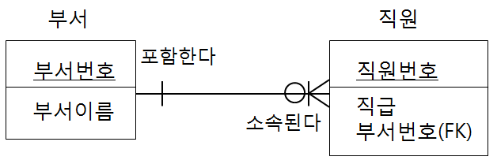

# 응용 소프트웨어 기초 기술 활용 평가
* 평가일 : 11월 5일 2시
## 단원별 학습 목표
### 1. 운영체제 기초 활용하기
* 1.1 응용 소프트웨어를 개발하기 위하여 다양한 운영체제의 특징을 설명할 수 있다.
* 1.2 CLI(Command Line Interface) 및 GUI(Graphic User Interface) 환경에서 운영체제의 기본 명령어를 활용할 수 있다.    
* 1.3 운영체제 제공하는 작업 우선순위 설정방법을 이용하여 애플리케이션의 작업우선 순위를 조정할 수 있다.
### 2. 데이터베이스 기초 활용하기
* 2.1 데이터베이스 종류를 구분하고 응용 소프트웨어 개발에 필요한 데이터베이스를 선정할 수 있다.
* 2.2 주어진 E-R 다이어그램을 이용하여 관계형 데이터베이스의 테이블을 정의할 수 있다.
* 2.3 데이터베이스의 기본연산을 CRUD(Create, Read, Update, Delete)로 구분하여 설명할 수 있다.
### 3. 네트워크 기초활용하기
* 3.1 네트워크 계층구조에서 각 층의 역할을 설명할 수 있다.
* 3.2 응용(어플리케이션)의 특성에 따라 TCP와 UDP를 구별하여 적용할 수 있다.
* 3.3 패킷 스위칭 시스템을 이해하고, 다양한 라우팅 알고리즘과 IP 프로토콜을 설명할 수 있다.
### 4. 기본 개발환경 구축하기
* 4.1 응용(어플리케이션)개발을 위하여 선정된 운영체제를 설치하고 운용할 수 있다.
* 4.2 응용(어플리케이션)개발에 필요한 개발도구를 설치하고 운용할 수 있다.
* 4.3 웹서버, DB서버 등 응용(어플리케이션)개발에 필요한 기반 서버를 설치하고 운용할 수 있다.
<br/>
<br/>
<br/>

## 문제 유형(문제만)
1. ER-Diagram보고 create문 적기
    * ERD  
        
2. 데이터베이스의 기본연산을 CRUD(Create, Read, Update, Delete)로 구분한다.  
    의미를 설명하고 대응되는 SQL DML 명령어를 작성하시오      
3. 관계형 데이터베이스와 NoSQL 데이터베이스의 특징 2가지씩 적고  
    대표적인 데이터베이스 엔진 2가지씩 작성하시오.    
4. 운영체제(OS)의 기본 기능 5가지를 나열하시오.   
5. 윈도우 운영체제에서 작업관리자를 통해서 현재 실행중인 프로세스들에 대해서 '우선순위 설정'과 '선호도 설정'을 수행할 수 있다. 각각의 의미에 대해 설명하시오.    
6. 자바 개발환경을 갖추기 위해 JDK와 eclipse를 설치하였다. 콘솔에서 java 실행시 또는 이클립스 실행시(eclipse.exe) JVM을 찾지 못했다는 오류메시지가 발생했을 경우 원인과 조치방법을 기술하시오.    
7. 아파치 톰캣 웹서버의 기본 포트는 8080으로 설정되어 있다.  
이를 8090포트로 변경하기위해서 해주어야할 작업을 기술하시오.
 (설정파일명과 수정내용을 적으세요)            
8. 아파치 톰캣 웹서버의 시작페이지 파일명을 변경하고자 한다. 각각 설정 파일명과 수정할 요소명을 작성하시오.     
9. 윈도우운영체제 네트워크 명령어  
ping, ipconfig, netstat, nslookup, tracert  
용도를 각각 작성하시오    
10. OSI모형의 7계층을 나열하시오.   
11. UDP와 TCP의 차이점을 비교설명하시오    
12. 7계층 중 네트워크 계층에 위치한 IP 프로토콜 기능을 작성하시오
<br/>
<br/>
<br/>


## 문제 & 답변
1. ER-Diagram보고 create문 적기
    * ERD  
        
    * SQL
        ```SQL
        CREATE TABLE 부서 (
            부서번호   VARCHAR2(10) ,
            부서이름   VARCHAR2(10) ,
            Primary key(부서번호)
        );
        CREATE TABLE 직원(
            직원번호 VARCHAR2(10),
            직급 VARCHAR2(10),
            부서번호 VARCHAR2(10),
            Primary Key(직원번호),
            Foreign Key(부서번호) references 부서(부서번호)
        );
        ```
2. 데이터베이스의 기본연산을 CRUD(Create, Read, Update, Delete)로 구분한다.  
    의미를 설명하고 대응되는 SQL DML 명령어를 작성하시오  
    * 답
        * Create : 레코드(튜플) 생성 `INSERT`
        * Read : 레코드(튜플) 조회, 검색 `SELECT`        
        * Update : 레코드(튜플) 수정, 변경, 갱신 `UPDATE`
        * Delete : 레코드(튜플) 삭제 `DELETE`
        * |연산|의미|DML 명령어|
            |Create|레코드(튜플) 생성|`INSERT`|
            |Read|레코드(튜플) 조회, 검색|`SELECT`|
            |Update|레코드(튜플) 수정, 변경, 갱신|`UPDATE`|
            |Delete|레코드(튜플) 삭제|`DELETE`|
3. 관계형 데이터베이스와 NoSQL 데이터베이스의 특징 2가지씩 적고  
    대표적인 데이터베이스 엔진 2가지씩 작성하시오.
    * 관계형 데이터 베이스
        * 특징
            * 데이터들간의 연관성이 많다.
            * 정형화된 데이터를 저장 관리한다.
        * 종류
            * Oracle 
            * MySQL 
            * MS-SQL
    * NoSQL 데이터베이스
        * 특징
            * 데이터들 간의 관계성이 낮다
            * 비정형화된 데이터를 저장 관리한다
            * 대용량 데이터 분석을 위해, 빅데이터 분야에서 사용된다.
            * "일단 데이터를 모아두고 나중에 분석하자"라는 접근
        * 종류
            * MongoDB
            * Redis
            * Cassandra
4. 운영체제(OS)의 기본 기능 5가지를 나열하시오.
    1. 프로세**스** 관리
        * 프로세스는 현재 실행중인 프로그램        
    2. 프로세**서** 관리
    3. 주기억장치 관리
    4. 보조기억장치(파일시스템) 관리          
    5. 입출력 관리
5. 윈도우 운영체제에서 작업관리자를 통해서 현재 실행중인 프로세스들에 대해서 '우선순위 설정'과 '선호도 설정'을 수행할 수 있다. 각각의 의미에 대해 설명하시오.
    * 우선순위 설정
        * 특정 프로세스의 우선순위를 높여 CPU점유율을 높이는(조절하는) 방식            
    * 선호도 설정
        * 특정 프로세스를 특정 코어에 고정 할당하여 CPU점유율을 높이는(조절하는) 방식
6. 자바 개발환경을 갖추기 위해 JDK와 eclipse를 설치하였다. 콘솔에서 java 실행시 또는 이클립스 실행시(eclipse.exe) JVM을 찾지 못했다는 오류메시지가 발생했을 경우 원인과 조치방법을 기술하시오.
    * 원인 : 환경변수 Path에 JDK 설치 경로 지정되지 않음
        > 환경변수(path)에 JDK툴 위치 경로 미지정
    * 조치방법 : 환경변수 Path에 JDK경로를 추가한다.
        * 환경변수 'Path'설정하기
            1. `windows` + `pause` 
            2. **고급시스템 설정** 클릭
            3. **고급**탭 클릭
            4. **환경변수** 버튼 클릭
            5. 시스템변수 목록에서 
            6. 'Path'라는 변수를 찾아서 수정
7. 아파치 톰캣 웹서버의 기본 포트는 8080으로 설정되어 있다.  
이를 8090포트로 변경하기위해서 해주어야할 작업을 기술하시오.
 (설정파일명과 수정내용을 적으세요)        
    * 포트번호 변경
        * 설정파일 : 톰캣설치경로/conf/server.xml
        * 수정할 요소 이름 : "Connector"         
    * port 바꾸기 방법
        1. `./tomcat9/conf/server.xml`를 notepad로 열기
        2. 'Connector'태그 찾기
        3. 찾아낸 태그의 port속성의 값을 바꾼다.
        4. 이후 톰캣을 재시작해 바뀐 설정을 적용한다.  
8. 아파치 톰캣 웹서버의 시작페이지 파일명을 변경하고자 한다. 각각 설정 파일명과 수정할 요소명을 작성하시오. 
   * 시작페이지 파일명 변경
        * 설정파일 : 톰캣설치경로/conf/web.xml
        * 수정할 요소 이름 : "welcome-file-list", "welcome-file"
            * "welcome"에 'l'이 하나인것에 주의
            * 요소(element)란 여는 태그와 닫는 태그로 둘러진 것들을 말함    
9.  윈도우운영체제 네트워크 명령어  
ping, ipconfig, netstat, nslookup, tracert  
용도를 각각 작성하시오
    * ping
        * 접속하려는 호스트가 네트워크에 연결되어 있는지 테스트 하는 명령어        
    * ipconfig
        * 현재 호스트(네트워크상의 장비 총칭)의 TCP/IP설정값을 확인하는 명령어  
        (IP주소, 게이트웨이, 서브넷마스크, DNS주소, MAC주소 등)        
    * netstat
        * 현재 호스트에 개방되어 있는 포트번호를 확인하는 명령어        
    * nslookup
        * 도메인주소를 IP주소로 변환 또는 IP주소를 도메인 주소로 알려주는 명령어        
    * tracert    
        * 출발지에서 목적지까지의 IP경로 추정 및 상태 흐름(회선점검)을 파악하는 명령어.            
    * arp
        * 네트워크 상의 IP주소와 MAC주소를 알려주는 명령어
10. OSI모형의 7계층을 나열하시오.
    * |계층|순서|
        |---|---|
        |응용계층(Application Layer)|맨 위|
        |표현계층(Presentation Layer)||
        |세션계층(Session Layer)||
        |전송계층(Transport Layer)||
        |네트워크(Network Layer)||
        |데이터링크계층(Data Link Layer)||
        |물리계층(Physical Layer)|맨 밑|
11. UDP와 TCP의 차이점을 비교설명하시오
    * ||TCP|UDP|
        |---|---|---|
        |연결|연결지향 프로토콜<br/>(연결이 먼저 성공되어야 통신 가능<br/>3-way-handshake 방식)|비연결지향 프로토콜<br/>(연결없이 통신 가능)|
        |신뢰성|신뢰성 있는 데이터 전송<br/>(오류제어, 흐름제어, 통신량조정)|비신뢰성 데이터 전송<br/>(패킷순서 보장X, 패킷손실 가능성 있음)|
        |연결대상개수| 1:1연결 | 일대일/일대다 가능|
        |예시|http,ftp|실시간 스트리밍|
    * TCP
        * 연결지향 프로토콜(연결이 먼저 성공되어야 통신가능), 3 way handshake 방식
        * 신뢰성 있는 데이터 전송(오류제어, 흐름제어, 통신량조정)    
        * 1:1통신 ex) http,ftp, 전화, 채팅 등
    * UDP
        * 비연결지향 프로토콜(연결없이 통신 가능)
        * 비신뢰성 있는 데이터 전송(패킷순서, 패킷손실 가능성 있음)
        * 1:1통신, 1:N통신 ex) 라디오, 오디오, 비디오 전송 
12. 7계층 중 네트워크 계층에 위치한 IP 프로토콜 기능을 작성하시오
    * 역할 : 호스트와 라우터간의 기본 통신 프로토콜로 IP패킷을 출발지 호스트에서 목적지 호스트까지 데이터 전달, 라우팅 경로 설정.
    * 특징 : 비연결형 프로토콜(연결과정 미수행)
<br/>
<br/>
<br/>

## 상세 설명
### 1. ER-Diagram보고 create문 적기
* ERD  
    
* SQL
    ```SQL
    CREATE TABLE 부서 (
        부서번호   VARCHAR2(10) ,
        부서이름   VARCHAR2(10) ,
        Primary key(부서번호)
    );
    CREATE TABLE 직원(
        직원번호 VARCHAR2(10),
        직급 VARCHAR2(10),
        부서번호 VARCHAR2(10),
        Primary Key(직원번호),
        Foreign Key(부서번호) references 부서(부서번호)
    );
    ```
### 2. 데이터베이스의 기본연산을 CRUD(Create, Read, Update, Delete)로 구분한다. 의미를 설명하고 대응되는 SQL DML 명령어를 작성하시오  
* 답
    * Create : 레코드(튜플) 생성 `INSERT`
    * Read : 레코드(튜플) 조회, 검색 `SELECT`        
    * Update : 레코드(튜플) 수정, 변경, 갱신 `UPDATE`
    * Delete : 레코드(튜플) 삭제 `DELETE`
* Table을 생성할 때 쓰는 `Create`는 DML이 아니라 DDL(Data Definition Language)이다.
    * DDL은 스키마를 정의할 때 쓴다.
* DML(Data Manipulation Language) 데이터를 조작하는 언어
### 3. 관계형 데이터베이스와 NoSQL 데이터베이스의 특징 2가지씩 적고 대표적인 데이터베이스 엔진 2가지씩 작성하시오.
* 관계형 데이터 베이스
    * 특징
        * 데이터들간의 연관성이 많다.
        * 정형화된 데이터를 저장 관리한다.
    * 종류
        * Oracle 
        * MySQL 
        * MS-SQL
* NoSQL 데이터베이스
    * 특징
        * 데이터들 간의 관계성이 낮다
        * 비정형화된 데이터를 저장 관리한다
        * 대용량 데이터 분석을 위해, 빅데이터 분야에서 사용된다.
        * "일단 데이터를 모아두고 나중에 분석하자"라는 접근
    * 종류
        * MongoDB
        * Redis
        * Cassandra
* 표 
    * ||관계형 DB|NoSQL DB|
        |---|---|---|
        |특징|- 데이터간 연관성이 많다.<br/>- 정형화된 데이터를 저장 관리한다 |- 데이터들간의 관계성이 낮다 <br/>- 비정형화된 데이터를 저장 관리한다. <br/>- 대용량 데이터 분석을 위해 사용 <br/>- 빅데이터분야에 사용된다.|
        |종류|-Oracle<br/>-MySQL<br/>-MS-SQL<br/>-PostgreSQL|-MongoDB<br/>-Redis<br/>-Cassandra|
### 4. 운영체제(OS)의 기본 기능 5가지를 나열하시오.
1. 프로세**스** 관리
    * 프로세스는 현재 실행중인 프로그램
    * 메모리에 적재된 프로그램
2. 프로세**서** 관리
    * 프로세서는 CPU와 동일한 의미
3. 주기억장치(RAM) 관리
4. 보조기억장치(파일시스템) 관리  
    * SDD, HDD 등
    * 파일시스템
        * EXT3, NTFS, FAT
5. 입출력 관리
    * 입력장치 : 키보드, 마우스
    * 출력장치 : 모니터, 스피커
### 5. 윈도우 운영체제에서 작업관리자를 통해서 현재 실행중인 프로세스들에 대해서 '우선순위 설정'과 '선호도 설정'을 수행할 수 있다. 각각의 의미에 대해 설명하시오.
* 우선순위 설정
   * 특정 프로세스의 우선순위를 높여 CPU점유율을 높이는(조절하는) 방식
       CPU를 얼마나 점유할 지
   * 방법 
       1. 작업관리자 열기 (`ctrl`+`shift`+`esc`)
       2. *프로세스* 탭 
       3. 설정을 바꿀 프로세스 우클릭 
       4. 우선순위 설정
       5. 다음 중 선택
            * 실시간(R)
            * 높음(H)
            * 높은 우선 순위(A)
            * 보통(N)
            * 낮은 우선 순위(B)
            * 낮음(L)            
* 선호도 설정
   * 특정 프로세스를 특정 코어에 고정 할당하여 CPU점유율을 높이는(조절하는) 방식
       * 프로세스가 어느 CORE를 선호할 지
   * 방법 
       1. 작업관리자 열기 (`ctrl`+`shift`+`esc`)
       2. *프로세스* 탭
       3. 설정을 바꿀 프로세스 우클릭 
       4. 선호도 설정
       5. 선호할 프로세스 체크
* CPU에서 작업은 한순간에 하나씩만 처리됨  
### 6. 자바 개발환경을 갖추기 위해 JDK와 eclipse를 설치하였다. 콘솔에서 java 실행시 또는 이클립스 실행시(eclipse.exe) JVM을 찾지 못했다는 오류메시지가 발생했을 경우 원인과 조치방법을 기술하시오.
* 원인 : 환경변수 Path에 JDK 설치 경로 지정되지 않음
    > 환경변수(path)에 JDK툴 위치 경로 미지정
* 조치방법 : 환경변수 Path에 JDK경로를 추가한다.
    * 환경변수 'Path'설정하기
        1. `windows` + `pause` 
        2. **고급시스템 설정** 클릭
        3. **고급**탭 클릭
        4. **환경변수** 버튼 클릭
        5. 시스템변수 목록에서 'Path'라는 변수찾기 
        6. 'Path'변수에 JDK경로 추가
* CLI가 실행파일의 경로를 찾는 과정 (명령창에서 명령어를 실행할 때 혹은 실행파일을 실행할 때 )
    1. 실행파일(명령어)가 경로와 함께 지정된 경우, 해당 경로의 실행파일을 실행
    2. 경로가 따로 지정되지 않았다면, 실행파일(명령어)를 현재디렉토리에서 찾아서 실행
    3. 환경변수 Path에 지정된 경로에서 실행파일(명령어)를 찾아 실행
    4. 찾을 수 없으면 *다음* 메시지와 함께 아무것도 실행되지 않음
    ```bash
    "명령어"은(는) 내부 또는 외부 명령, 실행할 수 있는 프로그램, 또는 배치파일이 아닙니다.
    ```    
* Windows CLI 명령어들
    * dir : 디렉토리에 있는 파일 목록 보여줌
    * cd : 현재 디렉토리 이름을 보여주거나 바꿈
    * cls : 화면을 지움
    * mkdir : 디렉토리를 생성
### 7. 아파치 톰캣 웹서버의 기본 포트는 8080으로 설정되어 있다. 이를 8090포트로 변경하기위해서 해주어야할 작업을 기술하시오. (설정파일명과 수정내용을 적으세요)        
* 포트번호 변경
    * 설정파일 : 톰캣설치경로/conf/server.xml
    * 수정할 요소 이름 : "Connector"         
* port 바꾸기 방법
    1. `./tomcat9/conf/server.xml`를 notepad로 열기
    2. 'Connector'태그 찾기
    3. 찾아낸 태그의 port속성의 값을 바꾼다.
    4. 이후 톰캣을 재시작해 바뀐 설정을 적용한다.    
* 톰캣 재실행방법
    1. JAVASTUDY/tomcat9/bin/tomcat9w.exe 실행
    2. properties 창에서 `stop`클릭
    3. properties 창에서 `start`클릭
* 톰캣이 실행중인지 확인하려면? 
   * 작업관리자의 서비스탭에 'Tomcat9'이 실행중인지 확인
* 포트를 바꾸고도 이전포트의 페이지가 계속 뜨는 이유는?
    * 브라우저캐시에 아까 떴던 페이지가 남아있기 때문!!
    * 캐시 지우는 단축키(인터넷 사용기록 지우는 단축키)
    * `ctrl`+`shift`+`del`    
    
### 8. 아파치 톰캣 웹서버의 시작페이지 파일명을 변경하고자 한다. 각각 설정 파일명과 수정할 요소명을 작성하시오. 
* 시작페이지 파일명 변경
    * 설정파일 : 톰캣설치경로/conf/web.xml
    * 수정할 요소 이름 : "welcome-file-list", "welcome-file"
        * "welcome"에 l이 하나인것에 주의
        * 요소(element)란 여는 태그와 닫는 태그로 둘러진 것들을 말함    
* 시작 페이지 파일명 변경
    1. `./tomcat9/conf/web.xml`를 notepad로 열기
    2. 'welcome-file-list'태그 찾기
    3. 찾아낸 태그에 맨 위 자식요소로 새로운 시작페이지 파일명이 지정된 'welcome-file'태그를 추가
* wellcome file list란?
    * url에서 특정 리소스파일을 지정하지 않으면 wellcome file list에서 설정된 file들을 순차적으로 찾는다.
    찾아진 파일을 응답으로써 보내준다.  
    * webapp ROOT디렉토리 내에서 찾음
    * 예시
        ```xml
        <welcome-file-list>
            <welcome-file>index.html</welcome-file>
            <welcome-file>index.htm</welcome-file>
            <welcome-file>index.jsp</welcome-file>
        </welcome-file-list>
        ```        
### 9.  윈도우운영체제 네트워크 명령어  ping, ipconfig, netstat, nslookup, tracert  용도를 각각 작성하시오
* windows에서 CLI 열기
    1. `ctrl` + `r`
    2. cmd 입력
    3. 확인 
* ping
    * 접속하려는 호스트가 네트워크에 연결되어 있는지 테스트 하는 명령어
    * -t 옵션
        * 중지될 때까지 ping실행
    * 사용 예시
        * loopback 주소
            * 127.0.0.1
            * 본인의 Ethernet카드가 문제있는지 확인할 경우
* ipconfig
    * 현재 호스트(네트워크상의 장비 총칭)의 TCP/IP설정값을 확인하는 명령어  
    (IP주소, 게이트웨이, 서브넷마스크, DNS주소, MAC주소 등)
    * [Microsoft - ipconfig](https://docs.microsoft.com/ko-kr/windows-server/administration/windows-commands/ipconfig)
    * `/all` 옵션
        * 자세한 정보를 표시
    * 물리적 주소 
        * MAC 주소( Ethernet 카드의 주소)
        * Ethernet 카드 제조사에서 부여함
    * DHCP
        * 서버에 의해서 자동으로 IP를 할당받음
    * IP주소 표기방법
        * IPv4
            * 32Bit로 표기
        * IPv6
            * 128Bit 
            * 16진수로 표기
            * IPv4로 할당할 주소가 부족해지면서 등장
    * 서브넷 마스크
        * 네트워크의 범위
    * 게이트웨이
        * 외부 네트워크로 연결되는 통로
    * DNS서버
        * Domain Name 
            * 사람이 인지할 수 있는 주소
            * 딱딱한 ip주소를 단어로 구성된 주소로 변환해줌.
            * 텍스트 기반
            * 예시
                * www.naver.com
                * www.google.com
        * DNS서버 
            * 도메인 네임을 주소로 변환해줌
        * DNS서버 설정이 없으면 네이버 주소를 못찾음
    * 윈도우상에서 ip알기
        1. 제어판가기
            * 시작키 -> 제어판 
            * windows + pause -> 제어판 홈
        2. 네트워크 및 공유센터
        3. 무선
        4. 어뎁터 속성 탭
        5. Internet Protocol Version4 선택
        6. 속성 클릭
* netstat
    * 현재 호스트에 개방되어 있는 포트번호를 확인하는 명령어
    * http포트는 80 ftp포트는 21,20
    * -a 옵션
        * 모든 연결과 수신 대기 포트를 표시합니다.        
* nslookup
    * 도메인주소를 IP주소로 변환 또는 IP주소를 도메인 주소로 알려주는 명령어
    * 도메인주소의 체계
        * 2자리 체계
        * 3자리 체계
    * 네이버는 서버 4개
* tracert    
    * 출발지에서 목적지까지의 IP경로 추정 및 상태 흐름(회선점검)을 파악하는 명령어.
    * 예시에서 첫번째 ip는 게이트웨이었음
    * 항상 같은 경로인 것은 아님
        * 실행시 마다 달라질 수 있음
* arp
    * 네트워크 상의 IP주소와 MAC주소를 알려주는 명령어
    * `arp -a` 입력
        * 현재 네트워크상에 ip와 mac주소를 알려줌
* cls
    * 창 클리어(내용을 다 지움)
* 윈도우 명렁어 뒤에 '/'문자와 함께 옵션을 지정할 수 있다.(대시도 가능)
* 사용방법을 알려면 '/?'를 해준다
* 게이트웨이를 통해서 통신이 외부로 나간다. 
    * 게이트웨이에 ping이 도달한다면 게이트웨이까지의 통신은 문제가 없는것
* `ctrl`+`c` 현재 실행 프로그램 종료
### 10. OSI모형의 7계층을 나열하시오.
1. 응용계층(Application Layer)
2. 표현계층(Presentation Layer)
3. 세션계층(Session Layer)
4. 전송계층(Transport Layer)
5. 네트워크(Network Layer)
6. 데이터링크계층(Data Link Layer)
7. 물리계층(Physical Layer)
### 11. UDP와 TCP의 차이점을 비교설명하시오
* TCP
    * 연결지향 프로토콜(연결이 먼저 성공되어야 통신가능), 3 way handshake 방식
    * 신뢰성 있는 데이터 전송(오류제어, 흐름제어, 통신량조정)
        * 중간에 패킷 손실 되더라도 다시 보냄
            * 데이터 손실을 복구함(신뢰성)
    * 1:1통신 ex) http,ftp, 전화, 채팅 등  
* UDP
    * 비연결지향 프로토콜(연결없이 통신 가능)
    * 비신뢰성 있는 데이터 전송(패킷순서, 패킷손실 가능성 있음)
        * 속도가 빠름
    * 1:1통신, 1:N통신 ex) 라디오, 오디오, 비디오 전송
### 12. 7계층 중 네트워크 계층에 위치한 IP 프로토콜 기능을 작성하시오
* 역할 : 호스트와 라우터간의 기본 통신 프로토콜로 IP패킷을 출발지 호스트에서 목적지 호스트까지 데이터 전달, 라우팅 경로 설정.
* 특징 : 비연결형 프로토콜(연결과정 미수행)
* ip
    * internet protocol
    * 패킷 교환 네트워크에서 정보를 주고받기위해 사용하는 프로토콜
    * 호스트
        * ip기반 네트워크에 연결된 장비
    * 네트워크 부분은 같아야함 호스트부분은 달라야함
    * 주소의 class
        * 네트워크 부분
        * 호스트 부분
    * 호스트 주소 부분이 0일경우 네트워크 자체
    * 모든 부분이 1일 경우 브로드캐스트
* 웹서비스 제공 절차
    * 웹브라우저 -> 웹서버
    * dns
    * arp
* OSI 모형 7계층 암기 요령
    * Top-down 
        * A-P-S-T-N-D-P
        * All-People Seem To Need Data Processing
    * Bottom-up
        * P-D-N-T-S-P-A
        * Please Do Not Throw Sausage Pizza Away
