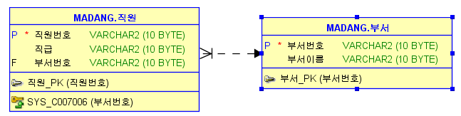

# 응용 소프트웨어 기초 기술 활용 평가
* 평가일 : 11월 5일 
## 단원별 학습 목표
### 1. 운영체제 기초 활용하기
* 1.1 응용 소프트웨어를 개발하기 위하여 다양한 운영체제의 특징을 설명할 수 있다.
* 1.2 CLI(Command Line Interface) 및 GUI(Graphic User Interface) 환경에서 운영체제의 기본 명령어를 활용할 수 있다.
    * GUI 단축키?   
* 1.3 운영체제 제공하는 작업 우선순위 설정방법을 이용하여 애플리케이션의 작업우선 순위를 조정할 수 있다.
### 2. 데이터베이스 기초 활용하기
* 2.1 데이터베이스 종류를 구분하고 응용 소프트웨어 개발에 필요한 데이터베이스를 선정할 수 있다.
* 2.2 주어진 E-R 다이어그램을 이용하여 관계형 데이터베이스의 테이블을 정의할 수 있다.
* 2.3 데이터베이스의 기본연산을 CRUD(Create, Read, Update, Delete)로 구분하여 설명할 수 있다.
### 3. 네트워크 기초활용하기
* 3.1 네트워크 계층구조에서 각 층의 역할을 설명할 수 있다.
* 3.2 응용(어플리케이션)의 특성에 따라 TCP와 UDP를 구별하여 적용할 수 있다.
* 3.3 패킷 스위칭 시스템을 이해하고, 다양한 라우팅 알고리즘과 IP 프로토콜을 설명할 수 있다.
### 4. 기본 개발환경 구축하기
* 4.1 응용(어플리케이션)개발을 위하여 선정된 운영체제를 설치하고 운용할 수 있다.
* 4.2 응용(어플리케이션)개발에 필요한 개발도구를 설치하고 운용할 수 있다.
* 4.3 웹서버, DB서버 등 응용(어플리케이션)개발에 필요한 기반 서버를 설치하고 운용할 수 있다.
## 문제 유형
1. ER-Diagram보고 create문 적기
    * ERD  
        
    * SQL
        ```SQL
        CREATE TABLE 부서 (
            부서번호   VARCHAR2(10) ,
            부서이름   VARCHAR2(10) ,
            Primary key(부서번호)
        );
        CREATE TABLE 직원(
            직원번호 VARCHAR2(10),
            직급 VARCHAR2(10),
            부서번호 VARCHAR2(10),
            Primary Key(직원번호),
            Foreign Key(부서번호) references 부서(부서번호)
        );
        ```
2. 데이터베이스의 기본연산을 CRUD(Create, Read, Update, Delete)로 구분한다.  
    의미를 설명하고 대응되는 SQL DML 명령어를 작성하시오  
    * Create : 레코드(튜플) 생성 `INSERT`
    * Read : 레코드(튜플) 조회, 검색 `SELECT`        
    * Update : 레코드(튜플) 수정, 변경, 갱싱 `UPDATE`
    * Delete : 레코드(튜플) 삭제 `DELETE`
3. 관계형 데이터베이스와 NoSQL 데이터베이스의 특징 2가지씩 적고  
    대표적인 데이터베이스 엔진 2가지씩 작성하시오.
    * ||관계형 DB|NoSQL DB|
        |---|---|---|
        |특징|- 데이터간 연관성이 많다.<br/>- 정형화된 데이터를 저장 관리한다 |- 데이터들간의 관계성이 낮다 <br/>- 비정형화된 데이터를 저장 관리한다. <br/>- 대용량 데이터 분석을 위해 사용 <br/>- 빅데이터분야에 사용된다.|
        |종류|-Oracle<br/>-MySQL<br/>-MS-SQL<br/>-PostgreSQL|-MongoDB<br/>-Redis<br/>-Cassandra|
4. 운영체제(OS)의 기본 기능 5가지를 나열하시오.
    1. 프로세스 관리
        * 프로세스는 현재 실행중인 프로그램
    2. 프로세서(CPU) 관리
    3. 주기억장치(RAM) 관리
    4. 보조기억장치(파일시스템) 관리  
        * EXT3, NTFS, FAT
    5. 입출력 관리
        * 입력장치 : 키보드, 마우스
        * 출력장치 : 모니터, 스피커
5. 윈도우 운영체제에서 작업관리자를 통해서 현재 실행중인 프로세스들에 대해서 '우선순위 설정'과 '선호도 설정'을 수행할 수 있다. 각각의 의미에 대해 설명하시오.
    * 우선순위 설정
        * 특정 프로세스의 우선순위를 높여 CPU점유율을 높이는 방식
        * 방법: 작업관리자에서 프로세스탭 -> 프로세스 우클릭 -> 우선순위 설정(CPU 점유율을 높임) 
    * 선호도 설정
        * 특정 프로세스를 특정 코어에 고정 할당하여 CPU점유율을 높이는 방식
        * 방법:  작업관리자에서 프로세스탭 -> 프로세스 우클릭 -> 선호도 설정(어느 CORE를 선호할 지) 
    * 한순간에 하나씩만 처리됨            
6. 자바 개발환경을 갖추기 위해 JDK와 eclipse를 설치하였다. 콘솔에서 java 실행시 또는 이클립스 실행시(eclipse.exe) JVM을 찾지 못했다는 오류메시지가 발생했을 경우 원인과 조치방법을 기술하시오.
    * 원인 : 환경변수(Path)에 JDK 위치 경로 미지정
    * 조치방법 : 환경변수 Path에 JDK경로를 추가한다.
    * CLI가 실행파일의 경로를 찾는 과정 (명령창에서 명령어를 실행할 때 혹은 실행파일을 실행할 때 )
        1. 명령어의 경로를 찾음
        2. 경로가 지정되지 않았다면 현재디렉토리에서 찾음
        3. 환경변수 Path에 지정된 경로에서 찾음
        4. 그래도 없으면 실행못함(없다고 말함)
    * 환경변수 'Path'설정하기
        * `windows` + `pause` -> 고급시스템 설정 -> 고급탭 -> 환경변수 -> 시스템변수 -> 'Path'라는 변수 수정
    * cli명령 
        * dir
        * cd
7. 아파치 톰캣 웹서버의 기본 포트는 8080으로 설정되어 있다.  
이를 8090포트로 변경하기위해서 해주어야할 작업을 기술하시오.
 (설정파일명과 수정내용을 적으세요)
 아파치 톰캣 웹서버의 서비스 포트번호와 시작페이지 파일명을 변경하고자 한다. 각각 설정 파일명과 수정할 요소명을 작성하시오.
    * Port 바꾸는법
        * `./tomcat9/conf/server.xml`를 notepad로 열기
        * 'Connector'태그 찾기
        * 태그의 port속성의 값을 바꾼다.
    * 톰캣 실행방법
        * JAVASTUDY/tomcat9/bin/tomcat9w.exe 실행
        * properties 창에서 `start`클릭
        * 작업관리자의 서비스탭에 'Tomcat9'이 실행중인지 확인
        * 작업관리자의 성능 탭
            * 각 화면이 core의 사용량
            * 리소스 모니터에서 CPU에 번호 붙은 애들도 각각 core의 사용량
        * http포트는 80 ftp포트는 21,20
        * webapps
    * wellcome file list란?
        * url에서 특정 리소스파일을 지정하지 않으면  
        wellcome file list에서 순차적으로 찾는다.
        찾아진 파일을 응답으로써 보내준다.
        * webapp ROOT디렉토리 내에서 찾음
    * 포트를 바꾸고도 계속 뜨는 이유는?
        * 브라우저캐시에 아까 떴던 페이지가 남아있기 때문!!
        * 캐시 지우는 단축키(인터넷 사용기록 지우는 단축키)
        * `ctrl`+`shift`+`del`
8. 시작페이지 파일명을 변경하고자 한다.  각각 설정 파일명과 수정할 요소명을 작성하시오.
    * 설정파일 : 톰캣설치경로/conf/web.xml
    * 요소(element 혹은 태그) 이름 : "welcome-file-list"
9. 윈도우운영체제 네트워크 명령어  
ping, ipconfig, netstat, nslookup, tracert  
용도를 각각 작성하시오
    * ping
        * 접속하려는 호스트가 네트워크에 연결되어 있는지 테스트 하는 명령어
        * 사용 예시
            * 
    * ipconfig
        * 현재 호스트(네트워크상의 장비 총칭)의 TCP/IP설정값을 확인하는 명령어  
        (IP주소, 게이트웨이, 서브넷마스크, DNS주소, MAC주소 등)
        * [Microsoft - ipconfig](https://docs.microsoft.com/ko-kr/windows-server/administration/windows-commands/ipconfig)
        * `/all` 옵션
            * 자세한 정보를 표시
        * MAC주소 
            * 장비의 주소
        * DNS서버
            * Domain Name이란 딱딱한 ip주소를 단어로 구성된 주소로 변환해줌.
            * DNS서버 설정이 없으면 네이버 주소를 못찾음
        * 윈도우상에서 ip알기
            1. 제어판가기
                * 시작키 -> 제어판 
                * windows + pause -> 제어판 홈
            2. 네트워크 및 공유센터
            3. 무선
            4. 어뎁터 속성 탭
            5. Internet Protocol Version4 선택
            6. 속성 클릭
    * netstat
        * 현재 호스트에 개방되어 있는 포트번호를 확인하는 명령어
        * -a 옵션
            * 모든 연결과 수신 대기 포트를 표시합니다.
        * http 접속에 9080을 쓰고 이후 다른 포트를 사용한다?
    * nslookup
        * 도메인주소를 IP주소로 변환 또는 IP주소를 도메인 주소로 알려주는 명령어    
        * 네이버는 서버 4개
    * tracert
    * 윈도우 명렁어 뒤에 '/'문자와 함께 옵션을 지정할 수 있다.(대시도 가능)
    * 사용방법을 알려면 '/?'를 해준다
    * 게이트웨이를 통해서 통신이 외부로 나간다. 
        * 게이트웨이에 ping이 도달한다면 게이트웨이까지의 통신은 문제가 없는것
