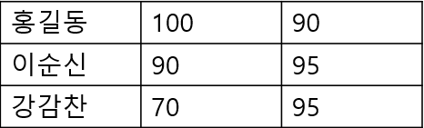
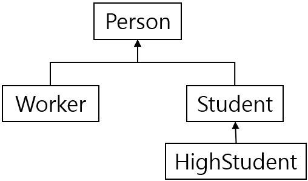

# 프로그래밍 언어활용 (JAVA)
### 1) 자바의 기본타입 8가지를 나열하고 배열이 오른쪽 그림과 같을 때 String 타입으로 <u>**선언,생성,초기화**</u>하는 <u>**실행문을 한 문장으로**</u> 작성하시오
#### 오른쪽 그림 


- 자바의 기본 타입 8가지 
    - boolean
    - char
    - byte
    - short
    - int
    - long
    - float
    - double
- 선언,생성,초기화 실행문(한 문장)
    - ```JAVA
        String[][] scores = new String[][] { {"홍길동","100","90"},
                                             {"이순신","90","95"},
                                             {"강감찬","70","85"}};
        ```
### 2) final 명령문이 <u>정적필드, 인스턴스필드, 메소드, 클래스에서</u> 사용시 <u>각각의 의미</u>를 작성하시오.
- 정적필드에서 final
    - 클래스 별로 사용되는 상수
- 인스턴스필드
    - 인스턴스 별로 사용되는 상수
- 메소드 
    - 상속하는 자손 클래스에서 재정의 못함
- 클래스
    - 자식 클래스를 가질 수 없다
### 3) 자바 언어에서 <u>예외처리방법 2가지</u>를 사용위치와 명령어를 정확히 표현하여 작성하고 사용목적을 작성하시오.
- 예외 처리방법 2 가지
    1. 예외발생 예상되는 실행문에 **try-catch-finally** 구문 처리
    2. 호출한 메소드로 위임해서 처리(메소드 선언부에 **throws**절 사용)
- 목적 
    - 프로그램 실행시 발생할 수 있는 예외(Runtime error)에 대비해서  
    코드를 작성해 프로그램 종료없이 정상적으로 작동하도록 하기 위함

### 4) 자바에서 추상클래스와 인터페이스의 <u>공통점과 차이점</u>을 <u>문법 관점에서 각각 2개씩만</u> 작성하시오.
- 공통점 
    - 인스턴스를 만들 수 없다.
    - 타입으로 사용할 수 있다.
- 차이점
    - 추상클래스
        - 멤버필드로 상수, 변수 다 가능
        - 단일 상속만 가능
        - 수직적인 관계
    - 인터페이스
        - 멤버로 상수, 추상메소드, 디폴트메소드, 정적메소드만 올 수 있다.
        - 다중구현/다중상속 가능
        - 수평적인 관계
        - 모든멤버가 public
### 5) 자바는 객체지향 언어라고 한다. <u>객체지향 언어 특징 4가지</u>를 나열하고 이중 <u>캡슐화</u>의 의미를 작성하시오.
- 객체지향 언어 특징 4가지 :
    1. 추상화
    2. 캡슐화
    3. 다형성
    4. 상속
- 캡슐화란 :
    - 객체의 속성(data field)과 행위(메서드, method)를 하나로 묶고,   
    실제 구현 내용 일부를 외부에 감추어 숨기는 것.
### 6) 다형성을 구현하기 위한 <u기술적 전제조건 3가지</u>와 <u>`instanceof` 키워드의 용도</u>는 무엇인가?
- 다형성을 구현하기위한 전제조건 3가지 
    1. 클래스의 상속관계 또는 인터페이스의 구현관계가 존재해야함.
    2. 부모타입에 자식타입이 대입돼야함
    3. 자식클래스에서 또는 구현클래스에서 메소드 재정의(overloadding)되어야 함
- instanceof 용도 
    - 참조변수가 참조하는 인스턴스의 실제 타입을 체크 하는데 사용함.  
      결과가 boolean 타입을 반환함

### 7) 오버라이딩의 <u>성립조건</u>과 <u>`@Override` 어노테이션의 사용목적</u>을 작성하시오.
- 성립조건
    1. 부모 메소드의 선언부(리턴타입, 메소드이름, 매개변수)가 동일해야한다.
    2. 접근제한자는 부모메소드와 동일하거나 범위가 넓어야한다.
- `@Override` 어노테이션의 사용목적 
    - 부모클래스의 메소드 선언부를 검색하여  
      일치하지 않으면 오류를 발행시켜 개발자에게 알려준다.

### 8) <u>스레드(thread)의 생성방법 2가지(클래스와 인터페이스를 정확히 표기)</u>와 <u>synchronized 키워드 사용목적</u>을 작성하시오.
1. Thread 클래스를 상속받아 생성
    * ```java
        class MyThread extends Thread {
            public void run () {/*작업 내용*/ }
        }
        ```
2. 직접 Runnable 인터페이스를 구현
    * ```java
        class MyThread implements Runnable {
            public void run() { /*작업 내용*/ }
        }
        ```
* synchronized 키워드 사용목적 
    * 멀티 스레드가 하나의 객체를 공유해서 생기는 오류 방지하기 위함   
### 9) API Document문서에 아래와 같이 선언부가 정의되어 있다면 course 매개변수 타입으로 올 수 있는 <u>타입을</u> 오른쪽 클래스 체계도를 참조하여 각각 나열하시오..<br>또한 <u>제너릭 타입 코딩 시 사용이점 2가지를 선언시점과 실행시점</u>으로 나우어 작성하시오.
#### 오른쪽 그림 
* 
#### 1. 선언부1
```java
public void register(Course<?> course)
```
#### 2. 선언부2
```java
public void register(Course<? extends Student> course)
```
#### 3. 선언부3
```java
public void register(Course<? super Worker> course)
```
- 매개변수로 올 수 있는 타입 :
    1. 선언부1 : 
        - Person, Worker, Student, HighStudent
    2. 선언부2 : 
        - Student, HighStudent
    3. 선언부3 
        - Worker, Person
- 제너릭 타입 코딩시 사용이점 2가지
    - 선언시점 
        - 컴파일 시점에 타입오류 방지
    - 실행시점 
        - 강제 형변환 과정이 불필요하며 프로그램 성능향상에 기여

### 10) 자바는 컬렉션 프레임워크를 제공하고 있다. SET,MAP,LIST계열의 특징을 <u>데이터중복</u>과 <u>순서</u> 관점에서 비교 작성하고 이를 구현한 java.util 패키지내의 <u>구현클래스 예를 2개씩</u>만 드시오.
||데이터 중복|순서|구현클래스|
|:---:|---|:---:|:---|
|**SET**|**비허용**|없음|HashSet, TreeSet|
|**MAP**|**키**는 **비허용**<br>**값**은 허용| 없음|HashMap, TreeMap, <br>Hashtable, Properties|
|**LIST**|허용|**있음**|ArrayList, LinkedList, Stack, Vector|

<br>
<br>
<br>

# SQL활용(Database)
### 다음 릴레이션을 보고 물음에 답하시오. Employee는 사원, Department는 부서, Project는 프로젝트, Works는 사원이 프로젝트에 참여한 내용을 나타낸다. 한 사원이 여러 프로젝트에서 일하거나 한 프로젝트에 여러 사원이 일할 수 있다. hoursworked 속성은 각 사원이 각 프로젝트에서 일한 시간을 나타낸다. 밑줄 친 속성은 기본키다.
**Employee**(<u>*empno*</u>, name, phoneno, address, sex, position, deptno)   
**Department**(<u>*deptno*</u>, deptname, manager)   
**Project**(<u>*projno*</u>, projanme, deptno)  
**Works**(<u>*empno*, *projno*</u>, hoursworked)
<br>

### 1) **Works 테이블을 생성하는 SQL문**을 작성하시오. **데이터 타입**과 **길이**는 **number 기본타입**으로 생성한다.
```sql
CREATE TABLE Works(
    empno NUMBER,
    porjno NUMBER,
    hoursworked NUMBER,
    PRIMARY KEY(empno, porjno)
);
```
### 2) 1)문항 수행 후 <u>**Works 테이블 구조**</u>와 <u>**제약조건 반영여부**</u>를 파악하기위해 <u>**데이터사전을 조회하는 SQL구문**</u>을 각각 작성하시오.
```SQL
SELECT * FROM ALL_TAB_COLUMNS WHERE TABLE_NAME = 'WORKS';-- 테이블 구조 구조
SELECT * FROM ALL_CONSTRAINTS WHERE TABLE_NAME = 'WORKS'; --제약조건 반영여부 파악하기
```
### 3) 아래 2개의 질의에 대한 <u>**SQL문을 각각 작성**</u>하시오.
#### 1. Employee 테이블에 **사원정보 튜플 1건을 생성**하시오.<br> &nbsp;&nbsp;&nbsp;&nbsp;&nbsp;(속성이 no로 끝나는 필드는 number타입, 나머지 속성은 varchar2타입이라고 가정함)
```sql
INSERT INTO Employee(empno,name,phoneno,address,sex,position,deptno) VALUES(1,'홍길동',01012345678,'울산광역시 남구','남','과장',1);
```
#### 2. 여자 사원의 **이름**을 검색하시오
```sql
SELECT name FROM Employee WHERE sex = '여';
```
### 4) <u>**트랜잭션의 정의**</u>, <u>**사용이유 2가지**</u>를 작성하고 관련 명령어인 <u>**commit, rollback, savepoint에 대해 각각 의미**</u>를 작성하시오.
- 정의 
    - DBMS에서 데이터를 다루는 논리적인 작업단위
- 사용이유
    1. 여러작업이 동시에 같은 데이터를 다룰 때 작업분리 단위.
    2. 장애발생시 데이터 복구 작업단위.
- 명령어
    - commit
        - 트랜잭션 과정을 정상적으로 종료하는 명령어
    - rollback
        - 트랜잭션 전체 또는 (저장점, 중간점)까지 취소하는 명령어.
    - savepoint
        - 하나의 트랜잭션을 분할 저장하여 현시점에서 저장점까지 트랜잭션 일부만 취소(rollback)가능하도록 지원하는 명령어.

### 5) 인덱스 생성시의 <u>**장점과 단점을 각각 2가지씩**</u> 작성하시오.
- 장점 
    - 검색 속도가 빨라짐
    - 시스템 부하를 줄여 전체 시스템의 성능을 향상시킨다.(ex, 조인)
- 단점
    - 인덱스 생성시 추가적인 database 공간을 차지한다 ( table의 10%내외)
    - 업데이트를 (insert, update, delete)가 자주 발생되는 컬럼에 사용시
        오히려 속도 저해 요인이 된다.
### 6) 사원테이블 `Employee.name` 컬럼에 인덱스를 생성하는 <u>**DCL문을 작성**</u>하시오.<br> &nbsp;&nbsp;&nbsp;&nbsp;&nbsp;&nbsp;(**인덱스명은 idx_name로** 정의할 것!)
```SQL
CREATE INDEX idx_name ON Employee(name);
```
### 7) 개발자로부터 사원, 부서 테이블을 아래와 같은 뷰로 만들어달라는 요청이 들어왔다. <u>**뷰 생성시 이점**</u>을 적고 <u>**뷰 속성정보(사원번호,사원명,부서명)를 제공하는 SQL문**</u>을 작성하시오(단, <u>**중복된 정보는 제거**</u>한다. **뷰이름은 vw_emp**)
- 뷰 생성 시 이점
    - 편리성 및 재상용성
        - 복잡한 질의를 뷰로 정의해 놓고 질의를 간단히 사용할 수 있음
    - 보안성
        - 필요한 속성만을 선별하여 보여줄 수 있음
    - 독립성 
        - 원본 테이블 구조가 변하더라도 응용에 영향을 주지 않음
* 뷰 생성 sql문
    * ```sql
        CREATE OR REPLACE VIEW vw_emp
        AS SELECT ep.empno, ep.name, dp.deptname 
            FROM Employee ep, Department dp
            where ep.deptno = dp.deptno;
        ```
### 8) '홍길동' 팀장(manager) 부서에서 일하는 사원의 수를 보이는 **SQL문을 작성**하시오.
```SQL
SELECT COUNT(*) AS 사원수 FROM Employee
WHERE deptno = (SELECT ep.deptno FROM employee ep , department dp WHERE ep.name='홍길동'  AND ep.empno=dp."manager");
```
### 9) 사원들이 일한 시간 수를 부서별, 사원 이름별 오름차순으로 하는 **SQL문을 작성**하시오.
```sql
SELECT dp.deptname 부서, ep.name 이름, SUM(wk.hoursworked) AS "일한 시간"
FROM Employee ep, Department dp, Works wk
WHERE dp.deptno=ep.deptno AND ep.empno=wk.empno
GROUP BY dp.deptname, ep.name
ORDER BY 부서 ASC ,이름 ASC;
```
### 10) 두 명 이상의 사원이 참여한 프로젝트의 번호, 이름, 사원의 수를 보이는 **SQL문을 작성**하시오
```sql
SELECT pr.projno 프로젝트의번호, pr.projname 프로젝트이름,  COUNT(wk.empno) 사원수
FROM Project pr, Works wk
WHERE pr.projno = wk.projno
GROUP BY pr.projno, pr.projname 
HAVING COUNT(wk.empno) >= 2;
```