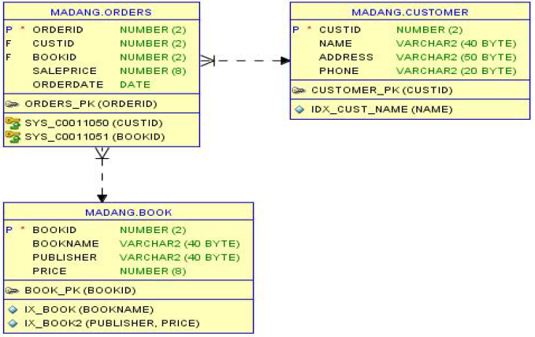

# SQL 응용 평가
## 기출 문제



### 1) 도서테이블에 동일도서(출판사,책이름이동일)가 있으면 도서의 가격만 새로운 값으로 변경하고 그렇지 않으면 삽입하는 프로시저　BookInsertOrUpdate()를 작성하시오. (단 : 예외처리를 반영하여 응용프로그램에서 SQLCODE, SQLERRM 값을 리턴 받을 수 있도록 구현하시오. 또한 예외처리부 SQLCODE,SQLERRM 콘솔 출력 포함

### 2) 특정 고객의 주문 총액을 계산하여 100만원 이상이면 ‘우수’, 100만원 미만이면 ‘일반’을 반환하는 함수 Grade()를 작성하시오.
### 3) 고객이 주문한 내용의 변경이 발생할 경우 백업테이블에 변경전 데이터를 기록하는 트리거 ordersLog()를 작성하시오.(단, 로그 테이블명은 ordersLog이고 속성은 순차적 로그를 기록하기 위한 seq 속성과 기록일시를 위한 logdate 속성이 추가되고 시퀀스명 ordersLog_seq가 생성되어 있으며 나머지는 oders테이블 속성과 동일하다고 가정함. 또한 예외처리부 SQLCODE,SQLERRM 콘솔 출력 포함).
### 4) 윈도우 함수와 그룹함수를 이용하여 출판사별 총판매금액, 판매순위를 산출하는 DML문 작성하시오.
### 5) `2)`에서 만든 grade()를 호출하여 고객의 이름과 등급을 보이는 SQL문을 작성하시오.
### 6) user1 사용자로부터 order테이블을 select하는 권한을 회수하는 DCL문을 작성하시오.
## 기출 문제 풀이

### 1) 도서테이블에 동일도서(출판사,책이름이동일)가 있으면 도서의 가격만 새로운 값으로 변경하고 그렇지 않으면 삽입하는 프로시저　BookInsertOrUpdate()를 작성하시오. (단 : 예외처리를 반영하여 응용프로그램에서 SQLCODE, SQLERRM 값을 리턴 받을 수 있도록 구현하시오. 또한 예외처리부 SQLCODE,SQLERRM 콘솔 출력 포함
```sql
CREATE OR REPLACE PROCEDURE BookInsertOrUpdate(
p_bookid     IN Book.bookid%TYPE,
p_bookname  IN Book.bookname%TYPE,
p_publisher   IN Book.publisher%TYPE,
p_price      IN Book.price%TYPE,
r_errcode    OUT number,
r_errmsg    OUT varchar2
)
AS
l_count number;
BEGIN
SELECT COUNT(*) 
    INTO l_count
    FROM Book WHERE publisher = p_publisher
                    AND  bookname = p_bookname;
IF l_count != 0 THEN
    -- 금액 수정
    UPDATE Book set price = p_price  
        WHERE publisher = p_publisher
        AND bookname = p_bookname;
ELSE 
    -- 도서정보 추가
    INSERT INTO book(bookid, bookname, publisher, price)
    VALUES (p_bookid, p_bookname, p_publisher, p_price);
END IF;
EXCEPTION
WHEN OTHERS THEN
    ROLLBACK;
    r_errcode := SQLCODE;
    r_errmsg := SQLERRM;
    DBMS_OUTPUT.PUT_LINE(r_errcode || '-' || r_errmsg );
END;

-- 답 확인하기
SET SERVEROUTPUT ON;
DECLARE 
l_sqlcode number;
l_sqlerrmsg varchar2(255);
BEGIN
BookInsertOrUpdate(17, '데이터베이스3', '한빛',40000, l_sqlcode, l_sqlerrmsg);
DBMS_OUTPUT.PUT_LINE('오류 :' || l_sqlcode || '-' || l_sqlerrmsg);
END;

``` 
### 2) 특정 고객의 주문 총액을 계산하여 100만원 이상이면 ‘우수’, 100만원 미만이면 ‘일반’을 반환하는 함수 Grade()를 작성하시오.
```sql
CREATE OR REPLACE FUNCTION Grade(
  p_custid IN customer.custid%TYPE
) RETURN VARCHAR2
IS
  l_sum NUMBER;
  l_grade VARCHAR2(6);
BEGIN
  SELECT SUM(saleprice) INTO l_sum
    FROM Orders
  WHERE custid = p_custid;
  IF l_sum >= 1000000 THEN
    l_grade := '우수';
  ELSE 
    l_grade := '일반';
  END IF;
  RETURN l_grade;
--EXCEPTION
--  WHEN OTHERS THEN
END;
```

### 3) 고객이 주문한 내용의 변경이 발생할 경우 백업테이블에 변경전 데이터를 기록하는 트리거 ordersLog()를 작성하시오.(단, 로그 테이블명은 ordersLog이고 속성은 순차적 로그를 기록하기 위한 seq 속성과 기록일시를 위한 logdate 속성이 추가되고 시퀀스명 ordersLog_seq가 생성되어 있으며 나머지는 oders테이블 속성과 동일하다고 가정함. 또한 예외처리부 SQLCODE,SQLERRM 콘솔 출력 포함).
```sql
CREATE SEQUENCE ordersLog_seq
  INCREMENT BY 1
	START WITH 1
	MAXVALUE 999999
	MINVALUE 1
	NOCYCLE
	NOCACHE;
CREATE TABLE ORDERSLOG(	
seq number,
logdate date,
ORDERID NUMBER(2,0), 
CUSTID NUMBER(2,0), 
BOOKID NUMBER(2,0), 
SALEPRICE NUMBER(8,0), 
ORDERDATE DATE, 
PRIMARY KEY (seq)
);

create or replace trigger ordersLog
AFTER UPDATE OR DELETE
ON ORDERS FOR EACH ROW
DECLARE
BEGIN  
  INSERT INTO ordersLog
  values(ordersLog_seq.nextval,sysdate,
      :old.orderid, 
      :old.custid, 
      :old.bookid, 
      :old.saleprice, 
      :old.orderdate);
EXCEPTION
  WHEN OTHERS THEN
    dbms_output.put_line(SQLCODE || '-' || SQLERRM);
END;
```
### 4) 윈도우 함수와 그룹함수를 이용하여 출판사별 총판매금액, 판매순위를 산출하는 DML문 작성하시오.
```sql
select t2.publisher "출판사", sum(t1.saleprice) "총매출액",
     rank() over (order by sum(t1.saleprice)desc) "순위"
from orders t1, book t2
where t1.bookid=t2.bookid
group by t2.publisher;
```
### 5) `2)`에서 만든 grade()를 호출하여 고객의 이름과 등급을 보이는 SQL문을 작성하시오.
```sql
select custid, name, grade(custid) as "등급" from customer;
```
### 6) user1 사용자로부터 order테이블을 select하는 권한을 회수하는 DCL문을 작성하시오.
```sql
REVOKE SELECT ON madang.Orders FROM user1;
```