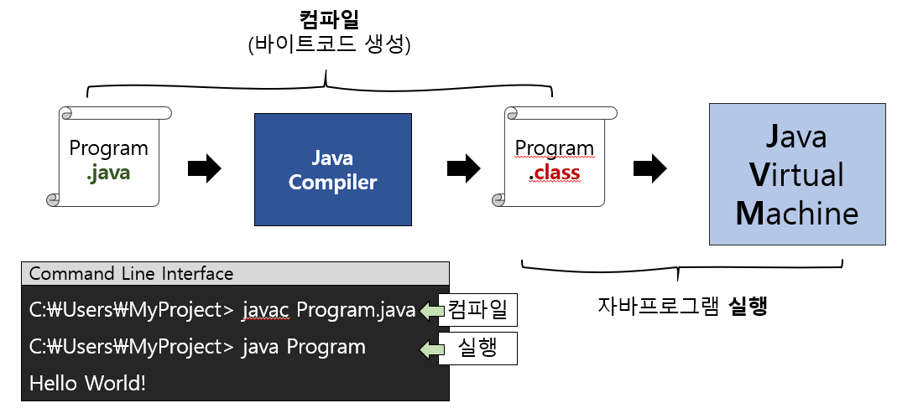

# What I studied today.
Date : 2019-10-18

## 수업 환경 설정 
1. `JAVASTUDY` 폴더 생성하기
2. 크롬 설치   
    1. [링크](https://www.google.com/intl/ko/chrome/)에서 Download 받기
    2. 설치파일 실행하기
3. Java SE Development Kit 8u321
    * 용도:
        * Java 소스코드 컴파일
        * Java 어플리케이션 실행
    * 준비물
        * 오라클 계정
    1. 다운받기
        1. Oracle 홈페이지 접속
        2. Download 
        3. Java `클릭` or Java 문단 찾기
        4. Java (JDK) for Developers `클릭`
        5. Java SE 8u231 에서
            1. JDK DONWLOAD
        6. Accept License Agreement `체크`
        7. jdk-8u231-windows-x64.exe `클릭`
            1. 오라클 계정이 있어야 가능
        * 안될 시 공유폴더에서 다운받기
            1. 실행창 켜기(`windows` key + `R`) 
            2. 다음을 입력
                * `\192.168.0.121` 
            3. download폴더
            4. 복사
    2. 수업용 파일 다운로드 경로 생성하기
        * 다음 경로에 폴더 생성.  
            `D:\\JAVASTUDY\download` 
        경로 생성
    3. 설치하기
        1. 다운받은 설치파일 실행하기
    4. 설치가 제대로 되었는지 확인
        1. 명령창 열기
            1. `windows` key + `R` -> 
            2. cmd 입력
        2. 명령창에서 확인하기 
            1. java 입력
                * 설치가 되지 않으면 명령어를 찾을수 없다고 뜬다.
            2. javac 입력
                * 마찬가지로 설치가 되지 않으면 명령어를 찾을수 없다고 뜬다. 
        3. 만약에 안되면 
            * 환경변수가 설정되지 않은 경우
                1. 환경변수 설정하기
                    1. 시스템 창 열기
                        * `windows`key + `pause` => 
                    2. 고급시스템 설정 클릭
                    3. 환경변수 탭 클릭
                        * 윗칸 : 지금 사용자만
                        * 밑칸 : 모든사용자(시스템)
                    4. (시스템)환경변수 JAVA_HOME 만들기 
                        * "C:\Program Files\Java\jdk1.8.0_201\bin"  
                        &nbsp;&nbsp;bin까지 함
                        * 보통 [제타위키 환경변수설정](https://zetawiki.com/wiki/윈도우_JAVA_HOME_환경변수_설정)대로 ""C:\Program Files\Java\jdk1.8.0_201"까지 함.
4. VSCODE 설치
    1. VS code 홈페이지서 설치파일 다운받기
        1. [링크](https://code.visualstudio.com/)
        2. `JAVASTUDY\dowload`경로에 다운받기
    2. 실행 후 계속 `다음`클릭
    3. extension 설치
        * 설치 방법
            1. `ctrl` + `shift` + `X` 
            2. 필요한 패키지 명 검색
            3. `install` 클릭
        설치할 extension들
            1. live server 
                * Author : Ritwick Dey
                * 작성한 웹문서를 확인할 수 있음 
            2. Prettier - Code formatter 설치
                * Author : Esben Petersen
                * HTML포맷 제공
    4. 기본 예제 작성해보기
        1. JAVASTUDY에 html폴더 생성
        2. 폴더 내에 Hello.html 생성
        3. `!`입력 이후 `tab` 하면 템플릿이 자동으로 생성된다.
        4. 창을 우클릭해서 `open with live server`하면 화면이 표시됨
5. 반디집 설치
    * sts 압축푸는데 씀
    1. 다운로드 - [링크](https://kr.bandisoft.com/bandizip/)
    2. 설치파일 실행하기
6. STS (Spring Tool Shoot) 4
    1. 설치 & download
        1. 구글에서 STS검색 혹은 [링크](https://spring.io/tools)
        2. Spring tools 4 for eclipse 찾고
        3. Download STS4 Windows 64-bit 클릭 혹은 [링크](https://download.springsource.com/release/STS4/4.4.1.RELEASE/dist/e4.13/spring-tool-suite-4-4.4.1.RELEASE-e4.13.0-win32.win32.x86_64.self-extracting.jar)
    2. workspace 설정하기
        1. JAVASTUDY폴더에 `javaedu` 폴더를 생성한다
        2. sts4 실행 후 javaedu폴더 경로 지정
    3. 이클립스 설정
        1. 인코딩 설정
            1. preferences 창 열기
                1. 메뉴 바에서 windows 클릭 
                2. preperence 클릭 
            2. 기본인코딩 설정
                1. preperences 창에서 encoding 검색 
                2. General의 content type 선택
                3. text 선택 
                4. default endoing에  "UTF-8"입력 
                5. 아래 apply 클릭
                6. workspace-> text file encoding -> other-> UTF-8 -> apply
            3. CSS File 인코딩 설정
                1. preperances 창에서 encoding검색 (위 과정과 같음)
                2. css Files 선택
                3. encoding 에서 ISO 10646/UTF-8 선택
            4. HTML Files 인코딩 설정 
                * 위 과정과 동일. 
            5. JSP Files 인코딩 설정
                * 위 과정과 동일
        2. 글꼴 및 폰트 변경
            1. preferences 창 들어가기(위 과정 참조) 
            2. General 선택 
            3. Appearance 선택
            4. colors and font 선택
            5. 본문 탐색창에서 basic 선택
            6. 아래로 드래그 한 뒤 text font 선택
            7. 우측 `edit` 버튼 클릭
        * 설정후에는 `Apply` 버튼 클릭해 적용하는 것 잊지말기!
    4. 프로젝트 생성하기
        1. 프로젝트 생성 
            1. 메뉴바에서 `File` 클릭
            2. New 클릭 
            3. JavaProject 클릭(생성마법사 창이 뜸)
            4. 창에서 Project name 칸에 프로젝트 이름입력 
            5. `finish`버튼 혹은 `next`버튼
        2. 클래스 생성하기
            1. sts화면좌측 project explorer에서 프로젝트의 src 우클릭 
            2. new 
            3. class (이후 생성마법사 창)
            4. Name 칸에 클래스이름입력하고(이름은 대문자로 시작하는것이 규칙)
                * Main() 메소드 자동생성하기 
                    * `public static void main(String[] args)` 클릭
7. 오라클 설치 (2019-10-24에 추가됨)
    * 오라클 서버 
        1. 다운로드
            1. 오라클 홈페이지
            2. 햄버거 메뉴
            3. download 
            4. 데이터베이스 문단
            5. Database 11g Enterprise/Standard Editions 
            6. Oracle Database Express Edition 문단 
            7. Oracle Database 11g Release 2 Express Edition for Windows 64  다운로드
        2. 설치
            1. 압축풀기 
            2. .\DISK1\setup.exe 실행
            3. license agree -> next
            4. browse 클릭 경로지정('D:\JAVASTUDY')
            5. password 설정 ('admin1234')
            6. install
        3. 실행
            1. 서비스 켜고 끄기 
                * 사용 서비스
                    1. oracleXETNSListener 
                    2. OracleServiceXE   
                * 실행/중지 방법
                    1. 작업관리자 실행/중지
                    2. 서비스관리자에서 실행/중지                    
    * SQL Developer Tool
        * 얘는 클라이언트 프로그램임
        1. 다운로드
            1. 오라클 홈페이지
            2. 햄버거 메뉴
            3. download 
            4. 개발자 툴 문단
            5. SQL Developer
            6. JDK를 이미 설치했기 때문에
                1. Platform 열의 "Windows 32-bit/64-bit" (410MB) 받기
        2. 설치
            1. 압축해제하기
        3. 실행
            1. jdk home 경로 지정
            2. 새 접속
            3. Name 지정 (`system`)
            4. 사용자이름 (`system`)
            5. 비밀번호 (`admin1234`)    
8. Tomcat 설치 (2019-10-24에 추가됨)
    * 톰캣이란 아래의 것들을 구현한 것
        1. Java Servlet
        2. JavaServer Pages
        3. Java Expression Language 
        4. Java WebSocket technologies
    1. tomcat home -> download tomcat9 -> 밑에 windows service installer
    2. configuration
        1. HTTP/1.1 Connector : `9080`
        2. AJP/1.3 Connector Port : `9009`
        3. username : `admin`
        4. password : `admin1234`
    3. 톰캣 설치경로 
        1. jvm경로는 jdk경로로 설정
        2. "D:\JAVASTUDY\tomcat9"
    4. 서버 포트 바꾸기
        1. tomcat9/conf/server.xml
    5. 서버외부에서 접속이 되지 않을 시
        1. windows7인 경우
        2. 시작 -> 고급 보안이 포함된 windows 방화벽 -> 좌측 인바운드 규칙 -> 우측 새 규칙 -> 포트 -> 특정 로컬 포트에 `9080` 입력 -> "계속" 다음 -> 이름 지정 -> 마침
9.  Notepad++ 
    1. 용도
        * 소스코드 외 텍스트 파일을 열어볼 용도
    2. 설치방법 
        * [링크](https://notepad-plus-plus.org/)에서 다운로드 후 설치파일 실행
10. 기타 
    * 보호된 운영체제 파일 숨기기(권장) **해제**
    * 숨김 파일, 폴더 및 드라이브 표시 **선택**
    * 알려진 파일 형식의 파일 확장자 숨기기 **해제**
    * 윈도우 커맨드라인 켜기
        1. `windows` key + `r`
        2. cmd 입력
        3. 실행
<br/>
<br/>
<br/>
   


# Java
## 자바 가상머신(JVM-Java Vitual Machine)
### 자바가상머신이란 ?
> 자바 바이트 코드를 실행하는 가상 기계
### 특징
* 각자 다른 플랫폼(운영체제)에도 동일한 자바 실행 환경을 제공
* WORA(Write Once Run Anywhere) 한번 작성되어 컴파일된 바이트코드는 어느 jvm이든 실행가능
* 자바 가상 기계 자체는 플랫폼에 종속적
    * 자바 가상 기계 개발 및 공급은 오라클 외 IBM, MS, Google등 다양한 회사에서 제작 공급
* 메모리관리기능(Garbage Collection)
<br/>
<br/>

### 자바 프로그램 작성 및 수행 절차  

1. 자바 소스코드 작성(program.java)
2. 컴파일러(javac.exe)가 소스코드(.java)를 컴파일함
    *  결과물로 바이트코드(.class)가 생성됨.
        * 아직 컴퓨터가 읽을 수 없다.
3. JVM에서 생성된 바이트코드 실행

<br/>

### /** 주석 */ HTML 문서화 주석처리  
`javadoc hello.java`
<br/>
<br/>

## java code 예제 
* 자바는 대소문자 구분 
```java
/**
    @author Hyeonuk
    @since 1.0.0
*/
public class Hello {

    public static void main(String[] args) {

        System.out.println("Hello World");

    }
}
```
* 이클립스에서 프로젝트 생성예시
    * javaprj 프로젝트 생성
    * Hello.java파일을 생성함(소스코드)
        * 소스코드 작성 후 저장하면 sts가 자동으로 class파일이 생성됨

```java
package javaprj;

public class Hello {
	
	public static void main(String[] args) {
		System.out.println("Hello World!");
	}
	
}

```
<br/>
<br/>
<br/>

## Eclipse Tips
### 들여쓰기
소스코드 짤 때 들여쓰기 내어쓰기는 중요!
* 들여쓰기 : `tab`키를 누른다. 
* 내어쓰기 : `shift` + `tab`키를 누른다.
* 들여쓰기 칸 수 설정법
    * window -> preference -> General -> Editor -> Text Editor -> displayed tab width -> 숫자 바꾸기
    * preference -> java -> Code Style -> Formatter -> edit -> Indentation -> Tab size 
<br/>
<br/>  

### 소스파일 이름 바꾸기
다음 방법으로 해야 자동으로 소스코드의 내부에 이름들도 바뀐다. 
* 소스코드에서 우클릭 -> Refactor -> 이름 바꾸기 -> finish
<br/>
<br/>

### System.out.println() 자동완성
* `sysout`타이핑 후 `ctrl`+`space` 
    ```java
        // 이 단어가
        sysout
        // 아래처럼 변한다.
        System.out.println()
    ```
<br/>
<br/>  

### 드래그된 코드 블럭 위/아래로 옮기기 
* 위로 옮기기
    * `alt` + `↑`
* 아래로 옮기기
    * `alt` + `↓`
<br/>
<br/>

### 자바프로그램의 기본구조
* 소스코드파일은 `.java`로 끝남
* class 단위로 구성됨
* 예제 소스
    ```java
    /*
    * 소스 파일 : Hello.java
    */
    public class Hello { // class

        public static int sum(int n , int m) { // method
            return n + m;
        }
        // start a context from the main() method
        public static void main(String[] args) { 
            int i = 20;
            int s;
            char a;
            
            s = sum(i,10);
            a = '?';
            System.out.println(a); // Call a method named "sum()"
            System.out.println("Hello"); // Print a character '?'
            System.out.println(s); // Print a "s" variable that is an integer
        }
    }

    ```
<br/>

### 변수 예제
* 변수란 하나의 값을 저장할 수 있는 기억공간
* 예제 소스
    ```java
    public class Test {
        public static void main(String[] args) {
            // 변수 란 하나의 값을 저장할 수 있는 기억공간
            int i = 10;
            int j = 20;
     
            i = 30;
            j = 40;
            
            i = 50;
            j = 60;
            
            int sum = i + j;
            System.out.println(sum);
    //		i = 3.14; // Encounter a Type mismatch error
            double x;
            x = 3.14;
            System.out.println(x);
            System.out.println("============");
            
            char c = '*';

            int num1 = 10;
            int num2 = 3;
    //		int result;
            double result;
            
    //		result = num1 / num2; // result == 3.0
            result = num1 / (double) num2; // result == 3.3333
            
            System.out.println(result);
            System.out.println("============");
            
            double num3 = 3;
            System.out.println(num3);
            System.out.println("============");
            
            boolean value = false;
            boolean value2 = true;
            
            if(value) {
                System.out.println("참");
            } else {
                System.out.println("거짓");
            }
        }
    }
    ```


<br/>
<br/>
<br/>

## 정리
1. JDK 설치
2. STS 설치
3. VSCode 설치
4. JAVA Project 및 Source(.java) 생성, 컴파일(.class), 실행(java.exe)

## 숙제
1. 집에서 복습
2. 오라클 계정 만들어오기     


<br/>
<br/>
<br/>

### 궁금한점
* 자바 바이트코드 실행과정은 어떻게 되나? class 
* main method는 왜 static인가?
* 자바의 강제 타입변환은 어떤 시점에 일어날까?


[돌아가기](../README.md)