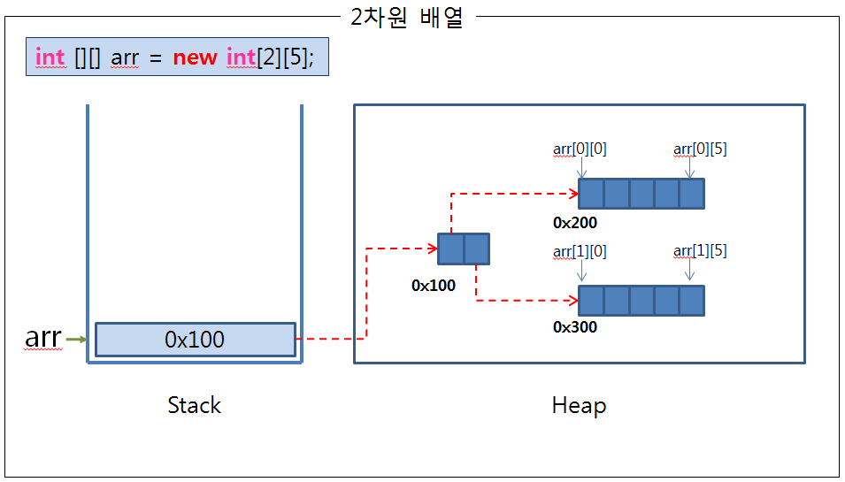
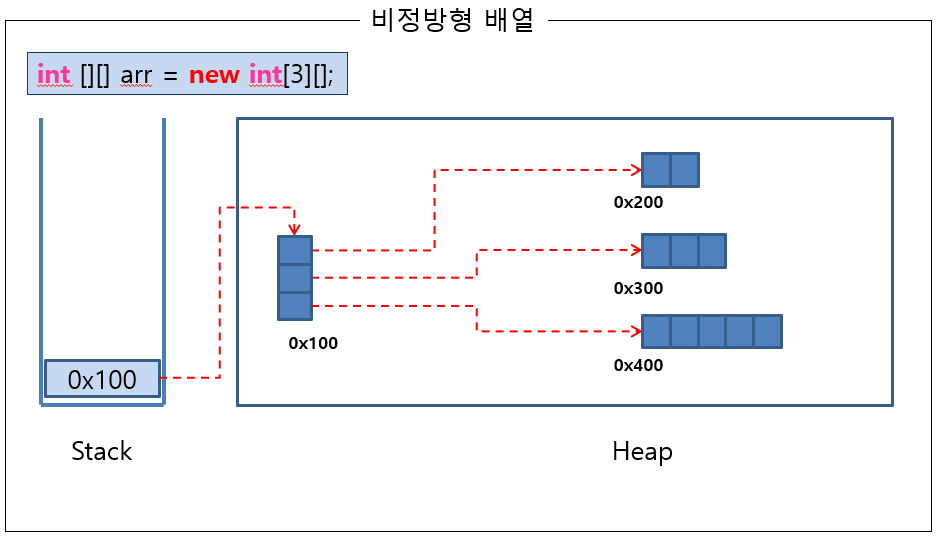
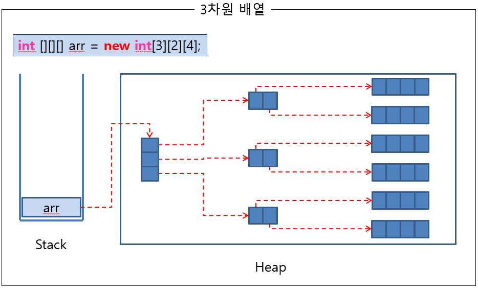

# What I studied today.
Date : 2019-10-30

## 복습
### 변수 정리
1. 변수:
    * 값을 저장하려고 메모리에 마련한 공간
    * 하나의 값을 저장하기 위한 메모리 공간
2. 상수:
    * 처음에 한번 메모리에 저장되어 변경되지 앟는 값.
    * 고정된 변수
    * 한번만 값을 저장할 수 있는 메모리 공간
3. 리터럴(값) : 순수 값 그자체          
    * 다음 코드에서 구분해보기    
        ```java
        int score = 100;
        score = 150;
 
        char ch = 'A';
        String name = "홍길동";
 
        final int MAX = 200;
        // MAX = 250; // 에러 발생
 
        final int MAX2;
        MAX2 = 200; // 값을 대입하는 것은 단 한 번 가능
        // MAX2 = 250; // 에러 발생
        ```
        * 변수 : socre, ch, name
        * 상수 : MAX
        * 리터럴 : 100, 'A', "홍길동", 200

4. 타입 : 변수 또는 상수에 저장될 데이터의 종류, 데이터의 범위
    * 기본형: 리터럴을 값으로 가짐
        * 정수형(byte, shore, char, int, long)
        * 실수형(float,double)
        * 논리형(boolean)
    * 참조형 : 객체의 주소값(heap메모리상의 주소값)을 가짐
5. 형변환
    * 자동형변환 : 작은타입을 큰타입으로 대입시 자동 형변환이 일어난다
    * 강제형변환 : 큰타입을 작은타입에 대입시 (타입) 캐스팅연산자 사용
        * 단, 값의 손실이 발생하지 않을때 의미있음
        * 따라서 값의 손실이 발생하면 계산하지 않도록 하는 로직이 필요할 수 있다.
6. 강제형변환시 값의 손실 원리 : 
    * 큰타입의 바이트수를 작은바이트로 분리하고 난 후  
    제일 오른쪽에서 부터 작은바이트만을 취하기 때문.
7. 기본타입에서 값의 범위를 초과하면 순회한다.
    * ex) byte num = 127;  
    &nbsp;&nbsp;&nbsp;&nbsp;&nbsp;&nbsp;num + 1 = -128
8. 정수를 실수로 변환할 때 float타입보다는 double타입을 사용한다  
    (double타입의 정밀도가 더 높다)
9. 변수의 사용범위 :  
     변수가 선언된 블럭 범위{} 내에서 생명주기를 갖는다.
## 배열
### 배열이란?
* 하니의 변수명, 동일타입, 연속된 메모리공간에 저장하는 자료구조
* 인덱스(첨자)로접근한다(인덱스는 0부터시작)
* 반복구문에 사용이 편리함
* 자바는 1차원 배열만 사용한다.
* 배열의 길이를 알 수 있는 속성 : length
* 배열의 크기는 변경불가
    * 변경하려면 새로운 배열을 생성해야함
        * 그리고 값을 복사.
### 메모리 속 배열
* 2차원 배열의 메모리

    * 2차원배열은 **배열의 배열이다**
    * 2차원배열은 다음으로 구성
        * **선언한 타입의 값**을 담은 1차원 배열들
        * **1차원 배열들의 주소**를 담은 1차원 배열
* 비정방형 배열의 메모리

    * 다른 길이의 배열을 담으면 정방형이 아닌 형태도 가능하다 
* 3차원 배열의 메모리
    * 결국 1개 차수의 배열만 1값을 담은 1차원 배열들이다
    * 나머지는 **배열을 담는** 배열
    * 앞의 차수를 곱한 만큼의 1차원 배열들이 생성됨 
        * 예시에서는 3 x 2 = 6개


### 배열 예제 탐구
* 배열의 `index`는 변수를 사용해서 접근할 수도 있다.
    ```java
    int socres[i+2] = 50;     
    ```
* 배열의 범위를 벗어난 인덱스의 값을 사용하면 `Exception`이 발생한다.
    * **실행** 시 발생 *컴파일 시* 아님
    * 코드
        ```java
            // for문으로 배열의 모든 요소를 출력한다.
            int[] scores = new int[]{10,20,30,40,50,60}; // 6개의 값
            for(int i=0; i < 7; i++) {
                System.out.printf("점수[%d]:%d%n",i, scores[i]);		
            }
        ```
    * Exception 메시지
        ```
        java.lang.ArrayIndexOutOfBoundsException: 6
        at ArrayExam.main(ArrayExam.java:20)
        ```
* `System.out.println()` 함수와 `char[]` 배열 
    * `System.out.println()`함수는 특별히 `char[]`에 대한 처리가 재정의 되어있다.
    * 다른 배열과 달리 문자열을 출력함
    * 예시
        ```java
        char[] charArr = {'W', 'o', 'r', 'l', 'd'};
        System.out.println(charArr);
		System.out.println(charArr+"");
		System.out.println(charArr.toString());
        ```
        * 예시 출력 
            ```
            World
            [C@7852e922
            [C@7852e922
            ```
* 배열의 크기를 바꾸려면!!
    1. 원하는 크기의 배열을 새로 생성
    2. 원본배열의 내용을 새 배열에 복사한다.
* 배열 복사하기! (2가지 방법)
    * `for`구문 사용하기
    * `System.arraycopy()` 함수 사용하기
* 접근제어자
    * private 
        * 같은 class 내에서만 접근 가능
    * 제어자생략 (default)
    * public
    * package
* 버블소트
    * 버블소트 예제는 한번은 봐둘 것
* `Arrays.sort()` 정렬 함수
* `String.toCharArray()`
    * String객체로 부터 char[] 타입의 배열을 만들수 있음
## 오늘 과제
* 문제)
    ```
    문제)
    애플리케이션 실행 시 실행 매개값을 전달하여 4칙연산 수행하기, (단, 피연산자는 양의 정수만 사용)
    ex) 입력값 : 6 + 7
        출력값 : 6 + 7 = 14
    1. 매개값은 3개만 입력받는다(피연산자 연산자 피연산자)
    2. 사칙연산 메소드로 분리
    3. 연산자 유효성 체크(+,-,X,x,/)만 허용
    4. 피연산자 유효성 체크 (0~9)의 정수범위만 가짐

    1~4를 만족하지 못하면 프로그램 종료
    종료 시엔 System.exit(0) 사용하기
    ```
* 답)
    ```java
    package com.kh.array;
    /**
    * 애플리케이션 실행 시 실행 매개변수를 전달하여 4칙연산 결과 수행하기!! 
    * ~추가 요구사항~ 
    * 1) 메소드 분리(사칙연산) 
    * 2) 연산자 유효성체크 
    * 3) 피연산자 유효성 체크 
    * @author Hyeonuk
    */
    public class Calculator {
        /**
        * 
        * @param left 왼쪽 피연산자 
        * @param right 오른쪽 피연산자
        * @return 덧셈결과
        */
        private static int plus(int left, int right) {
            return left + right;
        }
        /**
        * 
        * @param left 왼쪽 
        * @param right 오른쪽
        * @return 뺄셈 결과
        */
        private static int minus(int left, int right) {
            return left - right;
        }
        /**
        * 
        * @param left 왼쪽 
        * @param right 오른쪽
        * @return 곱셈 결과
        */
        private static int multi(int left, int right) {
            return left * right;
        }
        /**
        * 
        * @param left 왼쪽 
        * @param right 오른쪽
        * @return 나눗셈 결과
        */
        private static double divide(int left, int right) {
            return (double) left / right;
        }

        /**
        * 입력된 문자열을 int형으로 바꿈
        * @param numStr 바꿀 문자열
        * @return int숫자
        */
        private static int parseInt(String numStr) {
            int result = 0;
            for (int i = 0; i < numStr.length(); i++) {
                result *= 10;
                result += numStr.charAt(i) - '0';
            }
            return result;
        }
        /**
        * 유효성 체크(문자열이 숫자인지 )
        * @param numStr
        * @return 숫자이면 true
        */
        private static boolean checkString(String numStr) {
            for (int i = 0; i < numStr.length(); i++) {
                if (!isDigit(numStr.charAt(i))) {
                    return false;
                }
            }
            return true;
        }
        /**
        * 한 문자가 숫자인지 체크
        * @param c 체크할 문자
        * @return 숫자이면 true
        */
        private static boolean isDigit(char c) {
            if ('0' <= c && c <= '9')
                return true;
            return false;
        }

        public static void main(String[] args) {
            
            if (args.length != 3) {
                System.out.println("매개값 3개가 필요합니다.");
                System.out.println("[숫자] [연산자] [숫자]를 입력하세요!!");
                System.exit(0); // 프로그램 종료
            }
            if (!checkString(args[0]) || !checkString(args[2])) {
                System.out.println("피연산자는 양의 정수만 입력하세요!!");
                System.exit(0); // 프로그램 종료
            }

            int opL = parseInt(args[0]);
            int opR = parseInt(args[2]);

            switch (args[1]) {
            case "/":
                if (opR == 0) {
                    System.out.println("0으로 나눌 수 없습니다.");
                    System.exit(0);
                }
                double floatingPointResult = 0.0;
                floatingPointResult = divide(opL, opR);
                System.out.printf("%s %s %s = %f %n", args[0], args[1], args[2], floatingPointResult);
                break;
            case "+":
            case "-":
            case "X":case "x":
                int integerResult = ("+".equals(args[1])) ? plus(opL, opR)
                        : ("-".equals(args[1])) ? minus(opL, opR) : multi(opL, opR);
                System.out.printf("%s %s %s = %d %n", args[0], args[1], args[2], integerResult);
                break;
            default:
                System.out.println("연산자는 '+' '-' '/' 'x' 'X'");
                break;
            }

        }
    }

    ```

## 이클립스 팁
* method가 정의되지 않았을 때 에러 메시지도 뜨지만,
    * 메시지 아이콘을 클릭하면 
        * `Create method 메소드명(인자)`을 이용해 메소드의 *form*을 자동생성할수 있다.
* Run configurations에서 원하는 클래스가 실행되지 않을 때
    * Main탭에서 실행하길 바라는 클래스명이 맞는지 확인
        * 이후 필요하면 수정

## 팁
설정 -> 자바스크립트 -> 차단 -> 추가 

## 궁금한점
* JAVA에서는 객체가 문자열 연산할 떄, 왜 toString함수를 불러오는 이유는?
* System.arraycopy() 
* 두 숫자를 곱한 결과가 Type의 범위를 벗어나는지는 어떻게 알지?

[돌아가기](../README.md)  
[2019-10-29](whatIStudied_191029.md)  
[2019-10-31](whatIStudied_191031.md)  