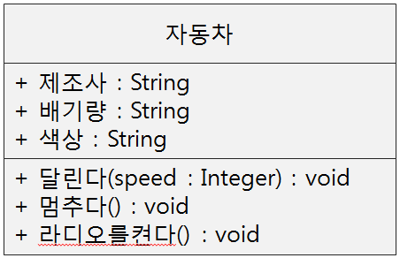
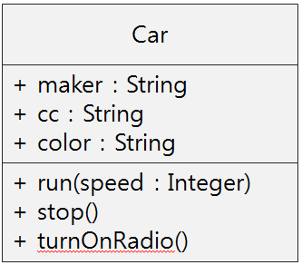
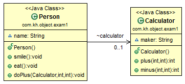

# What I studied today.
Date : 2019-11-06
## 앞으로의 수업진행
* 오전: JAVA
* 오후: Database

# JAVA 복습
## 1장 자바 시작하기
* JVM
* Java API Documents
* Comment(주석)
* javadoc를 이용한 API 도쿠먼트 작성
    * javadoc.exe
        * 자바 소스 파일로부터 API 도큐먼트 생성
        * 소스의 선언문과 /** 와 */ 사이에 주어진 정보를 바탕으로 HTML로 된 API 도큐먼트
        * 클래스, 인터페이스 생성자, 메소드, 필드 등을 기술
* 자바 프로그램의 기본구조
    * 클래스
    * 메소드
        * `Main()`메소드
            * Java프로그램 실행시 가정 먼저 찾음
* 식별자
    * 클래스,변수,상수,메소드 등에 붙이는 이름
    * 식별자 원칙
        * 대소문자 구분
        * 길이 제한없음
        * 영문자 숫자 혼용사용(숫자가 맨 앞에는 오면안됨)
        * 유니코드,한글,한자도 변수 사용 가능
        * 변수명은 보통 소문자
        * 특수문자는 변수명으로 사용 **불가**
            * `$`,`_`는 예외
        * 키워드는 식별자 사용 **불가**
        * 불린 리터럴(true, false) 사용 **불가**
        * 널 리터럴(null) 사용 **불가**
* 이름 짓기 관습
    * 기본 : 가독성 높은 이름
        * 목적을 나타내는 이름 붙이기 : s보다 sum
        * 충분히 긴 이름 붙이기 : AVM보다 AutoVendingMachine
    * 카멜케이스
## 2장 변수
* 변수
    * 변하는 수? 하나의 값을 저장할 수 있는 기억공간
    * 메모리상의 공간 "값을 담을 수 잇는 그릇"
* 변수의 타입(Data type)-자료형
    * 자바의 데이터 타입    
        * 기본형
            * 정수
                * byte
                * short
                * char
                * int
                * long
            * 실수 
                * float
                * double
            * 논리
                * boolean
        * 참조형
            * 배열
            * 열거
            * 클래스
            * 인터페이스
* 기본형의 값의 범위 비트 표현
* 변수의 선언 및 사용
    * 변수를 선언하는 방법:
        * 데이터 타입에서 정한 크기의 메모리 할당.
        * 변수선언과 동시에 저장될 값을 지정할 수 있음.
            * ```java
                int score;
                score = 100;
                int score2 = 100;
                ```
* String 클래스로 문자열 표현 : 문자열은 기본 타입이 아님
* 리터럴(literal) 이란?
      * 리터럴은 변수나 필드에 지정할 수 있는 "값"을 의미함.
      * 데이터 타입에 따라 표기법이 다름
      * 정수, 실수, 문자, 논리, 문자열 리터럴 있음
* 정수 리터럴
    * 10진수, 8진수, 16진수, 2진수 리터럴
        * 십진수 `15`를 다른 진수 리터럴로 나타내기
        * 
* 실수 리터럴
    * 소수점 형태나 지수형태로 표현한 실수
    * 실수 타입 리터럴은 double타입으로 컴파일
        ```java
        double d = 0.1234;
        double e = 1234E-4; // 0.1234와 동일
        ```
    * 숫자 뒤에 명시적으로 f(float), d(double)을 붙이기도함
* 문자 리터럴
    * 단일 인용부호('')로 문자 표현
    * 특수문자 리터럴은 백슬래시로 시작
* 논리 리터럴은 2개 뿐
    * true,false
    * boolean 타입 변수에 치환하거나 조건문에 이용
* null 리터럴
    * 레퍼런스 변수에만 사용
* 문자 리터럴(=스트링 리터럴)
    * 이중 인용부호로 묶어 표현
    * 문자열 리터럴은 String 객체로 자동 처리
* 숫자 리터럴의 아무 위치에나 언더스코어('_') 허용
    * 컴파일러가 '_'빼고 처리함
    * 허용되지 않는 경우
        * 리터럴 끝에 사용 불가
        * 소수점(.) 앞뒤에 사용 불가
        * L(F)앞에 사용 불가
        * 0x중간이나 앞뒤에사용불가
* 변수의 사용범위
    * 변수가 선언된 블록범위 {} 내에서 생명주기를 가짐
* 상수
    * 한번 초기화 이후 변경할 수 없음
    * final 키워드 사용
## 3장 연산자
* 연산식에서 자동 타입 변환
* 연산은 같은 타입의 피연산자(operand)간에만 수행
    * 서로 다른 타입의 피연산자는 같은 타입으로 변환
* 식 expression
* 연산자 operator
* 피연산자 operand
    * 연산자의 작업대상
* 증감연산자 주의점
    * prefix(앞에오느)냐 postfix(뒤에오느)냐에 따라 달라짐
* 쇼트서킷
    * 논리연산자
    * 조건연산자(삼항연산자) 
## 4장 제어문
* 제어문-조건문
    * 단순 if
    * if - else
    * if - else if문
    * switch    
* 제어문-반복문
    * for
        * 반복횟수를 알고 있을 때
    * 항샹된 for
    * while
    * do-while
* 제어문-분기문
    * break
    * continue
    * label
        * 반복문에 이름을 붙임(분기할 위치)
        * 먼저 반복분 앞에 label로써 이름을 붙임
        * 분기문(break,continue) 뒤에 label로써 붙인 이름을
            *  해당위치로 분기함.
* JVM 메모리 구조와 과정
    * JVM 메모리 구조
    * JAVA source
        * 사용자가 작성한 JAVA코드
    * JAVA Complier 
        * JAVA 코드를 Byte Code로 벼한시켜주는 기능
    * Class Loader
        * Class 파일을 메모리(Runtime Data Area)에 적재하는 기능
    * Excution Engine
        * Byte Code를 실행 가능하게 해석해주는 기능
    * Runtime Data Area 
        * 프로그램을 수행하기 위해 JVM이 OS에서 할당 받은 메모리 공간
* Runtime Data Area
    * 메소드 영역
        * 메소드의 바이트 코드
        * 클래스 변수
    * 스택영역
        * 매개변수
        * 지역변수
        * 반환 값
        * 임시 변수
    * 힙영역
    * PC레지스터
    * Native 메소드 스텍
## 5장 배열
* 같은 타입의 데이터를 연속된 공간에 저장하는 자료구조
* 배열은 객체로 인식
* 같은 타입(기본형,참조형)의데이터들이 순차적으로 저장
    * 인덱스를 이용하여 원소 데이터 접근. 인덱스는 0부터 시작
    * 반복문을 이용하여 처리하기에 적합
* 배열의 선언과 생성
    * 타입 똔느 변수이름 뒤에 대괄호[]를 붙여서 배열을 선언
    * length필드 사용
* 배열의 장점
    * 중복된 변수 선언을 줄이고 반복문을 이용해 요소를 쉽게 처리가능
* 배열의 길이
    * 코드에서 배열의 길이 얻는 방법
    * 배열 객체 내에 length 필드는 배열의 크기를 나타냄
        * String은 length 함수였음
* 다차원 배열
    * 자바에서 메모리 상에 그려지는 배열구조는 다 1차원
    * 자바의 다차원 배열은 1차원배열의 조합으로 구성됨
    * 정방형 배열
    * 비정방형 배열
    * 메소드의 배열 리턴
        * 메소드 반환 타입을 배열로 지정
* 향상된for문
    * for-each문
* 배열의 메모리 생성구조
    * 정방형 배열의 메모리생성구조
    * 비정방형 배열의 메모리 생성구조

# JAVA 객체지향 프로그래밍
## 객체지향 프로그래밍
* OOP(Object Oriented Programming)
* 부품 객체를 먼저 만들고 이것들을 하나씩 조립해 완성된 프로그램을 만드는 기법
## 객체(Object)란?
* 물리적으로 존재하는 것(자동차, 책, 사람)
* 추상적인 것(회사, 날짜) 중에서 자신의 속성과 동작을 가지는 모든 것
* 객체는 필드(속성)과 메소드(동작)로 구성된 자바 객체로 모델링 가능
  
## 클래스
* 클래스란?
    * 클래스란 객체를 정의해 놓은 틀.
    * 객체를 생성하는데 사용
    * 추상화
        * 현실세계의 것을 class코드로 만듬
    * 현실 세계의 객체를 설계함(설계도)
* 클래스의 구성
    * 속성(명사) -> 데이터
    * 행위(동사) -> 데이터를 조작
* 객체와 인스턴스
    * 객체(object)는 인스턴스(instance)를 포함하는 일반적인 의미
    * 현실세게의 객체 **==**추상화(모델링)**==>** 클래스 **==**객체화(인스턴스화)**==>** 인스턴스(객체)
        * 인스턴스화?
            * 가상공간에 객체(인스턴스)를 만드는 행위
            * 메모리 공간에 할당되는 것
            * new 키워드를 사용
    * 용어구분 필요
        *  현실세계의 객체인지 인스턴스(객체)인지
* 객체의 상호작용
    * 객체들은 서로 간에 기능(동작)을 이용하고 데이터를 주고 받음
    * **메소드 호출**과 **결과 리턴**을 통해서 상호작용
### 클래스의 종류
* 라이브러리 클래스 
    * 메인메소드가없는 클래스
* 실행클래스
    * 메인메소드가 있는 클래스
    * `Main()`메소드 가 없으면 실행할 수 없다
        * eclipse에서도 none applicable
* method에서 void리턴값
    * 반환값을 받지 않겠다.
### 클래스 다이어그램
* 정의 
    * 정보와 행위를 캡슐화한 것
* 요소
    * Class name : 이름
    * Attribute : 속성
    * Operation : 행위
    * Visibility : 가시성 ( + : public , - : private, # : protected)
    * Signature : 데이터 형식 , 오퍼레이션의 용법 표시
* 표기법
    * |Class name|
        |---|
        |Attribute|
        |Operation()|
* 예제
    * |Window|
        |---|
        |- origin<br>- size|
        |+ open()<br>+ close()<br>+ move()<br>+ display()|
    * |Window|
        |---|
        |- origin : Integer<br>- size : Integer = 10|
        |+ open() : Boolean<br>+ close() : Boolean<br>+ move(x : integer = 0, y : integer = 0) : Boolean<br>+ display()|
### 클래스 만들기 실습
* 현실실세계에 존재하는 객체를 가상세계로 불러오기
* 자동차클래스
    1. 다이어그램 그려보기
    2. 일단 자연어로   
        
    3. 제대로 클래스명, 필드명, 메소드명 정하기  
          
    4. 다이어그램대로 소스코드 작성  
        ```java
        package com.kh.object.exam2;
        /**
        * Car 클래스
        * 2019.11.06 Java SW Engineering Course
        * @author Hyeonuk
        */
        public class Car {
            public String maker;
            public String cc;
            public String color;

            public void run(int speed) {
                System.out.println(maker+"(이)가 "+speed+"km/h로 달립니다");
            }
            public void stop() {
                System.out.println(maker+"(이)가 멈췄습니다");
            }
            public void onRadio() {
                System.out.println("라디오가 켜졌습니다.");
            }
        }
        ```  
### 클래스 간의 관계

### UML
* 세 구역으로 구성
    * 클래스명
        * C라는 아이콘은 클래스라는 표시
    * 필드
    * 메소드
        * 메소드 아이콘 위에 c는 생성자 메소드라는 뜻
* 생성자 메소드
    * 리턴 타입이 없다
    * 클래스명과 메소드명이 똑같다.
    * 용도 
        * 객체 생성시 초기값 설정


## eclilpse Tips
* view 메뉴 클릭(package explorer 옆에 역삼각형)  
    * package presentation
        * flat
        * hirachical 클릭
            * 패키지를 계층적으로 보여줌
* 매개변수 간 이동하기 
    * 메소드 호출문을 작성할 때 자동완성된 매개변수에 박스가 쳐지면
        * `tab`키와 `shift` + `tab`키로 이동가능하다

* 클래스다이어그램 플러그인 설치
    * help->install new software
        * http://www.objectaid.com/update/current
        * add 
        * name은 클래스 다이어그램
        * add
        * 전체 체크
        * next
        * next
        * accept license 
* UML생성하기
    * 프로젝트에서 new 
    * others
    * ObjectAid UML Diagram
        * ObjectAid Class Diagram
        * ObjectAid Sequence Diagram


# 데이터베이스
## 예시) 마당서점 
* 경영자
* 운영자
* 프로그래머
* 고객
* 책
### 마당서점의 데이터
## 누가 어떤 정보를 원하는가?
* 고객, 운영자, 경영자 마다 필요한 데이터가 다르다
    * 고객 
        * 관심사에대한 책이 있는지?
        * 특정 출판사의 도서
        * 정해진 가격대의 도서
    * 운영자
        * 판매액의 합계
        * 어느 고객이 얼마나 주문하는지
        * 도서를 사지 않는 고객
    * 경영자
        * 월별 매출 동향
        * 도서별 판매 동향
## 커맨드라인에서 오라클 접속하기
* Run SQL Command Line
    * 는 사용하지 않기로함
### SQLPlus 사용하기
* 윈도우 명령프롬프트에서 
    * `sqlplus` 실행(입력)
    * username : madang
    * password : madang
* 보통 admin계정(system)은 잘 안씀
    * 권한이 막강하기 때문
## SQL Developer
* 화면구성
    * 메뉴와 도구바(위)
    * 네비게이터 (화면 왼쪽)
    * 질의작성기(가운데)
        * 워크시트 등
    * 출력화면 (밑)
        * 결과 뜨는 곳  
* 접속 마법사
    * SID
        * 데이터베이스 인스턴스 이름
* 행번호 항상 표시하기 설정
    1. 도구
    2. 환경설정
    3. 코드 편집기
        * 글꼴에서 글자 크기및 글꼴 설정가능
        * 형식 
            * 고급형식
                * 들여쓰기 공간 설정가능
    4. 행 여백
    5. 행 번호 표시 
    
## 명령어들
* 현재 접속자 확인하기
    * `show user;`
* 종료할때는 (아래 둘다 가능)
    * quit 
    * exit
* `conn` 명령어
    * 특정유저로 접속함
    * 예시
        ```sql
        conn [username]/[password]
        ```
## SQL
### 기능에 따른 분류
* DDL(데이터 정의어)
    * 테이블이나 관계의 구조를 생성하는 데 사용
    * CREATE, ALTER, DROP 등
* DML(데이터 조작어)
    * 테이블에 데이터를 검색, 삽입, 수정, 삭제하는 데 사용
    * SELECT, DELETE, UPDATE 등 
    * SELECT문은 특별히 질의어(QUERY)라고 함
* DCL(데이터 제어어)
    * 데이터의 사용 권한을 관리하는 데 사용
    * GRAND, REVOKE 등
* sql에서 관례적으로 키워드는 대문자로 씀
### SQL 예시(김연아 고객 전화번호 찾기 )
* JAVA와 달리 문자열에 작은따옴표 (`'`) 사용
* sql문
    ```sql
    SELECT phone
    FROM customer
    WHERE name = '김연아';
    ```
* 결과를 엑셀 형식으로 export하기
    1. 우클릭 
    2. export
    3. 형식
    4. excel로 변경
    5. 찾아보기(경로지정)
    6. 다음
    7. 완료
### select문의 기본 형식
* select문의 구성요소
    * 키워드 
        * SELECT
            * 속성이름
        * FROM
            * 테이블 이름
        * WHERE
            * 검색 조건
* select문 기본 문법
    ```sql
    SELECT [ALL | DISTINCT] 속성이름(들)
    FROM        테이블이름(들) 
    [WHERE  검색조건(들)]
    [GROUP BY 속성 이름]
    [HAVING 검색 조건(들)]
    [ORDER BY 속성이름 [ASC | DESC]]
    ```
* DISTINCT
    * 중복된 정보 제거
    * 예시
        ```sql
        SELECT DISTINCT bookname
        FROM book;        
        ```
* WHERE절 조건
    * |술어|연산자|예|
        |---|---|---|
        |비교|=,<>,<,<=,>,>=| price < 20000|
        |범위|BETWEEN| price BETWEEN 1000 AND 2000|
        |집합|IN, NOT IN| price IN(1000,20000,30000)|
        |패턴|LIKE|BOOKNAME LIKE '축구의 역사|
        |NULL|IS NULL, NULL|price IS NULL|
        |복합조건|AND, OR, NOT|(price <20000) AND (bookname LIKE '축구의 역사')|