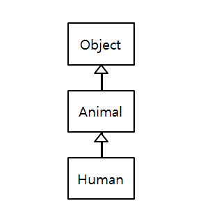

# What I studied today.
Date : 2019-11-13

# Java
## 상속(수업 내용 요약)
* 상속은 클래스를 추상화하거나 구체화하는 과정에서 발생
* 상위 객체의 속성이 하위 객체에 물려짐 (단일상속, extends키워드)
    * 물려받은 메서드의 내용을 수정하는 것도 가능하다.(오버라이딩)
    * 자바는 클래스 다중 상속 없음
    * 인터페이스 다중 상속 허용
* 하위 객체가 상위 객체의 속성을 모두 가지는 관계(재사용성)
* 자신만의 필드나 메서드를 추가하여 구체화하는 것이 가능.
* 상속의 UML 표현  
    
    * 화살표에서 화살표 끝은 비어있는 삼각형이어야함
* 생성자 안 맨 위에는 자동으로 `super()`(부모생성자)가 삽입된다.(컴파일러단계)
* 자식 클래스에서는 부모클래스의 정보를 알 수 있지만  
부모클래스에서는 자식클래스의 정보를 알 수 없다.
* 상속이 안되는 것들
    * 초기화 블록
    * protected
### 재정의(overriding) 
* 부모메소드의 몸체(구현부, 바디)를 새롭게 정의해서 사용하는 방식
* 전제조건
    1. 상속관계
    2. 부모메소드의 선언부가 동일해야한다.
* Overriding 중 가능한 실수
    * 재정의 하다가 오타가 날 수 있음(부모의 멤버메소드에 없는 이름)
    * 그럼 재정의가 아닌 새로운 메소드 정의가 됨.
    * `@Override`라는 어노테이션을 사용해야함
    * 손쉽게 재정의 하려면 
        * 이클립스의 자동완성(`ctrl`+`space`)를 사용
    * toString의 경우
        1. 에디터 내에서 우클릭
        2. Source
        3. Generate toString() 클릭
* `@Override` 어노테이션
    * 부모클래스에서 지금 만드는 메소드의 선언부와 같은 선언부의 메소드가 있는지 찾음
    * 없으면 오류!!
    * 프로그래머의 실수를 줄여준다.
## 상속 용어 정리
1. 상속 
    * 상위 객체의 속성(멤버)가 하위 개체에 물려짐(단일상속만 허용,`extends` 키워드 사용)
    * 목적
        * 재사용( 기존 소프트웨어의 설계, 구현, 테스트에 투입된 시간, 노력을 재활용)
            * 기존 클래스의 필드와 메소드를 그대로 받아 사용할 수 있다.
            * 수정할 필요가 있는 멤버는 재정의해서 사용한다.
                * 멤버 필드의 재정의는 비권장
    * 관계
        * IS-A 관계
            * 인간이 동물을 상속할 경우 
            "인간은 동물이다"가 성립함
        * HAS-A 관계
2. 재정의
    * 정의
        * 부모 메소드 구현부를 새로 정의해서 사용하는 개념
    * 전제조건
        * 부모 메소드의 선언부(리턴타입, 메소드 이름, 매개변수)가 동일해야한다.
        * 접근제한자는 부모메소드와 동일하거나 범위가 넒어야한다.
# Database
## 부속질의
### 상관 부속질의(correlated subquery) 
* 상위 부속질의의 투플을 이용하여 하위 부속질의를 계산함.
## 집합연산
* 합집합 UNION
* 차집합 MINUS
* 교집합 INTERSECT
## EXISTS
* 조건에 맞는 튜플이 존재하면 결과에 포함시킴
* 부속질문의 어떤 행이 조건에 만족하면 참
  NOT EXISTS는 부속질의문의 모든 행이 조건에 만족하지 않을 때만 참
  ```
  SELECT       name, address
  FROM         Customer cs
  WHERE
