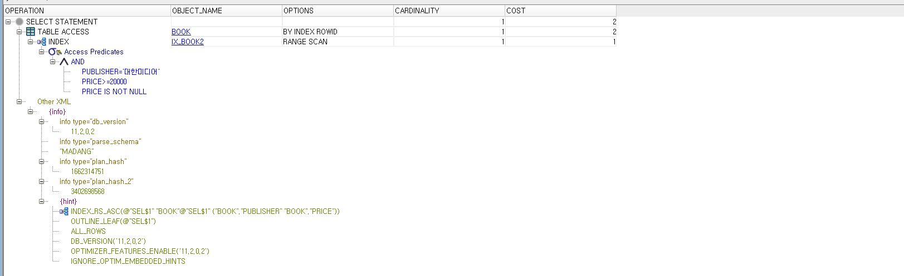
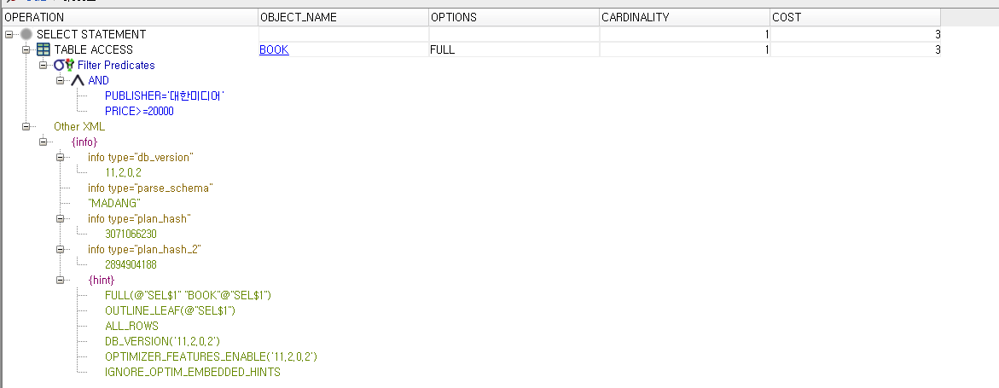
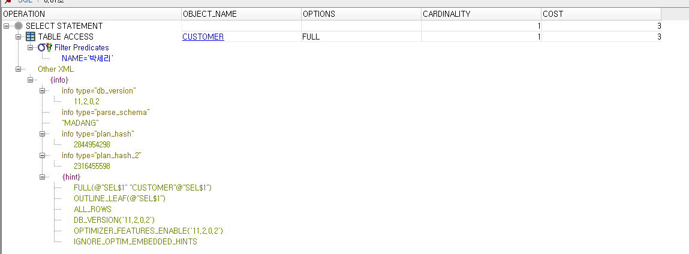
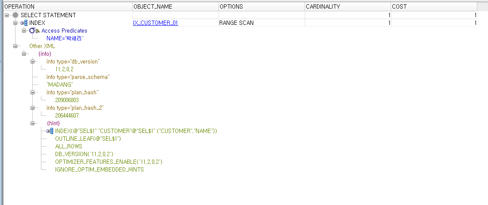

# What I studied today.
Date : 2019-11-25

# JAVA
## 예외처리
- 목적 : 프로그램 실행 시 발생할 수 있는 예외(Runtime error)에 대비해서 코드를 작성해  
    프로그램 종료없이 정상적으로 작동하도록 하기 위함
- 종류 : 
    1. checked exception : 
        - Exception을 상속한 클래스  
            컴파일 시점에 반드시 예외처리해야 함
        - ex) InterruptedException
    2. unchecked exception :  
        - RuntimeException을 상속한 클래스로 예외처리는  
        선택사항 
        - ex) NullpointerException
- 방법 : 
    1. 예외발생 예상되는 실행문에 try-catch-finally구문 처리
    2. 호출한 메소드로 위임해서 처리(메소드 선언부에 throws절 사용)
- 문법오류 주의사항 :
    - 멀티 catch블록에서 상위타입은 아래에 배치함
## 제너릭(Generic)
- 정의 
    - 클래스, 인터페이스, 메소드 내부에서 사용할 데이터 타입을 파라미터화 해서 
    외부에서 지정하고 컴파일 시 구체적인 타입이 결정되도록 지원하는 문법
- 이점 :
    - 제너릭타입 변수 선언 시 : 컴파일 시점에 타입오류 방지
    - 제너릭타입 변수 사용 시 : 강제 형변환 과정이 불필요하며 프로그램 성능향상에 깅
- 제너릭 타입 파라미터 제한
    - extends 상위타입(클래스,인터페이스) : 상위타입 이하로 타입 제한
    - super는 사용불가
- 제너릭 메소드
    - 리턴타입 앞에 다이아몬드 연산자를 사용해서 외부에서 파라미터 타입을 결정하며 
    메소드의 리턴타입과 매개변수 타입에 사용하는 메서드
- 제너릭 메서드 타입 파라미터 제한
    - extends 상위타입(클래스, 인터페이스) : 상위타입 이하로 타입 제한
    - super 하위타입(클래스, 인터페이스) : 하위타입 이상으로 타입 제한
- 와일드 카드 타입
    - 이미 선언되어 있는 제너릭 타입의 인스턴스를 매개변수나 리턴 타입으로 사용할 때 
    타입 파라미터를 제한할 목적으로 사용
- `제너릭타입 <?>` : 제한 없음
    - ```java
        public static void registerCourse(Course<?> course)
        ```
- `제너릭타입 <? extends 상위타입>` 
    - ```java
        public static void registerCourse(Course<? extends Student> course)
        ```
- `제너릭타입 <? super 하위타입>` 
    - ```java
        public static void registerCourse(Course<? super Worker> course)
        ```
    - 더 이상 확장 못하게 함
## 컬렉션 프레임 워크(Collection Framework) 
- 컬랙션
    - 사전적 의미로 요소(객체)를 수집해 저장하는 자료구조
- 배열의 문제점
    - 저장할 수 있는 객체 수가 배열을 새엇ㅇ할 때 결정
        - 불특정 다수의 객체를 저장하기에는 문제
    - 객체 삭제했을 대 해당 인덱스가 비게 됨
### 컬렉션 프레임워크의 주요 인터페이스
- 값을 담을 수 있는 그릇을 의미
- List
    - 배열과 유사하게 인덱스로 관리
- Set
    - 집합과 유사
- Map
    - 키와 값의 쌍으로 관리


### 컬렉션 예시
```java
import java.util.ArrayList;
import java.util.Arrays;
import java.util.List;
/**
 * 2019.11.24 Java SW Engineering Course
 * @author Hyeonuk
 */
public class ArrayListMain {
	
	public static void main(String[] args) {
		List<String> list = new ArrayList<String>();
//		List<Integer> list = new ArrayList<Integer>();
		list.add("java");
		list.add("jdbc");
		list.add("servlet/jsp");
		list.add("html");
		list.add("css");
		list.add("javascript");
		
		// 컬렉션 요소 갯수
		int size = list.size();
		System.out.printf("총 객체 갯수: %d%n",size);
		System.out.println("======================");
		
		// 요소 검색 - 인덱스
		String element = list.get(2);
		System.out.println(element);
		System.out.println("======================");
		
		// 컬렉션 요소 전체 목록
		for(int i=0; i < list.size(); i++) {
			element = list.get(i);
			System.out.printf("%d : %s%n",i,element);
		}
		System.out.println("======================");
		
		// 컬랙션 요소 삭제
		list.remove(2);
		for(int i=0; i < list.size(); i++) {
			element = list.get(i);
			System.out.printf("%d : %s%n",i,element);
		}
		System.out.println("======================");
		
		// 요소 검색 - 특정 요소
		if(list.contains("java")) {
			System.out.println("java 있음!");
		}
		if(list.contains("servlet/jsp")) {
			System.out.println("servlet/jsp 있음!");			
		}
		System.out.println("======================");
		
		// 컬랙션 요소 전체 목록
		int cnt=0;
		for( String str : list) {
			System.out.println(++cnt+":"+str);
		}
		System.out.println("======================");
		
		// 배열을 리스트 계열로 전환하기
		List<String> list2 = Arrays.asList("길동","길순","길남","길서");
		for(String str: list2) {
			System.out.println(str);
		}
		List<Integer> list3 = Arrays.asList(1,2,3,4,5);
		for(Integer num: list3) {
			System.out.println(num);
		}
		
	}
	
}

```
## 프로세스
- 프로세스(process)
    - 실행중인 프로그램
    - 하나의 프로그램이 다중 프로세스를 만들기도 한다
    - 프로그램을 실행하면 OS로부터 실행에 필요한 자원(메모리)을 할당받아 프로세스가 됨
- 멀티테스킹
    - 두 가지 이상의 작업을 동시에 처리하는 것
    - 멀티 프로세스 - 독립적으로 프로그램들을 실행하고 여러 가지 작업 처리 
        - ex) 브라우저
    - 멀티 스레드 - 한 개의 프로그램을 실행하고 내부적으로 여러 가지 작업 처리 
        - ex) 채팅
- 하나의 프로게스에서 다중작업을 할 필요가 있을 때 멀티 스레드를 씀
### ArrayList vs Vector 
- 멀티스레드 환경에서 안전한지
- 멀티스레드를 고려안한 컬렉션이 더 성능이 빠름
- HashMap vs Hashtable도 비슷한 경우
### ArrayList vs LinkedList
- 삽입 삭제가 빈번하면 LinkedList가 유리
- 순차적인 추가/삭제는 ArrayList가 더 유리
- 예시
    - ```java
        public static void main(String[] args) {
            List<String> list1 = new ArrayList<>();
            List<String> list2 = new LinkedList<>();
            
            long startTime = 0l;
            long endTime = 0l;

            System.out.println("맨 앞에 추가하기");
            startTime = System.nanoTime();
            for(int i=0; i<100000;i++) {
                list1.add(0,String.valueOf(i));
            }
            endTime = System.nanoTime();
            System.out.printf("ArrayList걸린 시간:%d ns %n",endTime-startTime);
            
            startTime = System.nanoTime();
            for(int i=0; i<100000;i++) {
                list2.add(0,String.valueOf(i));
            }
            endTime = System.nanoTime();
            System.out.printf("LinkedList걸린 시간:%d ns %n",endTime-startTime);
            
            // 맨 앞부터 삭제
            System.out.println();
            System.out.println("맨 앞에부터 삭제");
            startTime = System.nanoTime();
            for(int i=0; i<100000;i++) {
                list1.remove(0);
            }
            endTime = System.nanoTime();
            System.out.printf("ArrayList걸린 시간:%d ns %n",endTime-startTime);		
            startTime = System.nanoTime();
            for(int i=0; i<100000;i++) {
                list2.remove(0);
            }
            endTime = System.nanoTime();
            System.out.printf("LinkedList걸린 시간:%d ns %n",endTime-startTime);
            
            // 맨 뒤에 추가
            System.out.println();
            System.out.println("맨 뒤에 추가하기");
            list1 = new ArrayList<>();
            list2 = new LinkedList<>();
            startTime = System.nanoTime();
            for(int i=0; i<100000;i++) {
                list1.add(String.valueOf(i));
            }
            endTime = System.nanoTime();
            System.out.printf("ArrayList걸린 시간:%d ns %n",endTime-startTime);
            
            startTime = System.nanoTime();
            for(int i=0; i<100000;i++) {
                list2.add(String.valueOf(i));
            }
            endTime = System.nanoTime();
            System.out.printf("LinkedList걸린 시간:%d ns %n",endTime-startTime);
            
            
            // 맨 뒤부터 삭제
            System.out.println();
            System.out.println("맨 뒤부터 삭제");
            startTime = System.nanoTime();
            for(int i=0; i<100000;i++) {
                list1.remove(list1.size()-1);
            }
            endTime = System.nanoTime();
            System.out.printf("ArrayList걸린 시간:%d ns %n",endTime-startTime);		
            startTime = System.nanoTime();
            for(int i=0; i<100000;i++) {
                list2.remove(list2.size()-1);
            }
            endTime = System.nanoTime();
            System.out.printf("LinkedList걸린 시간:%d ns %n",endTime-startTime);
        }
        ```
* 출력 :
    * ```
        맨 앞에 추가하기
        ArrayList걸린 시간:449019206 ns 
        LinkedList걸린 시간:7231463 ns 

        맨 앞에부터 삭제
        ArrayList걸린 시간:370065962 ns 
        LinkedList걸린 시간:4066978 ns 

        맨 뒤에 추가하기
        ArrayList걸린 시간:6718183 ns 
        LinkedList걸린 시간:5589281 ns 

        맨 뒤부터 삭제
        ArrayList걸린 시간:3160820 ns 
        LinkedList걸린 시간:2397575 ns 

        ```
### 객체 해시코드(hashCode())
- 객체 해시코드란?
    - 객체 식별할 하나의 정수값
    - 객체의 메모리 번지 이용해 해시코드를 만들어 리턴
        - 개별 객체는 해시코드가 모두 다름
- 논리적 동등 비교 시 hashCode()오버라이딩의 필요성
    - 컬랙션 프레임워크의 HashSet, HashMap과 같이
### Map 컬렉션의 특징 및 주요 메소드
- 특징
    - 키(key)와 값(value)으로 구성된 Map.Entry 객체를 저장하는 구조
    - 키와 값은 모두 객체
    - 키는 중복될 수 없지만 값은 중복 저장 가능
- 구현 클래스
    - HashMap, Hashtable, LinkedHashMap, Properties, TreeMap
- 주요 메소드
    - 객체 추가
        - `V put(K key, V value)`
            - 주어진 키와 값을 추가 저장이 되면 값을 리턴
    - 객체 검색
        - `boolean containsKey(Object key)`
            - 주어진 키가 있는지 여부
        - `boolean containsValue(Object key)`
            - 주어진 값이 있는지 여부
        - `Set<Map.Entry<K,V>> entrySet()
            - 키와 값의 쌍으로 구성된 모든 Map.Entry 객체를 Set에 담아서 리턴
            - iterator 쓰려고
        - `V get(Object key)`
            - 주어진 키의 값을 리턴
        - `boolean isEmpty()`
            - 컬렉션이 비어있는지 여부
### map 예제
#### 과제 12 
```
Map, Set, List를 각각 이용해서 다음의 아이디 점수를 저장하고
총점, 평균, 최고점수 받은 아이디 출력하기

아이디 점수
white 	80
black	90
red		100

총점 :
평균 :
최고점수를 받은 아이디 : 
```
- 풀이 :
    - ```java
        import java.util.HashMap;
        import java.util.Map;

        public class ScoreManager {
            public static void main(String[] args) {
                Map<String,Integer> map = new HashMap<>();
                
                map.put("white", 80);
                map.put("balck", 90);
                map.put("red", 100);
                
                int totalScore=0;
                double average=0;
                int scoreHighest = Integer.MIN_VALUE;
                String idHighest = null;
                for(Map.Entry<String, Integer> entry: map.entrySet()) {
                    int score = entry.getValue();
                    totalScore +=score; 
                    if(scoreHighest<score) {
                        idHighest = entry.getKey();
                        scoreHighest = score;
                    }
                }
                average=(double)totalScore/map.size();
                System.out.println("총점 : " +totalScore);
                System.out.println("평균 : " + average);
                System.out.println("최고점수를 받은 아이디 : "+idHighest);
                System.out.println("\t"+idHighest+"의 점수:"+scoreHighest);
            }
        }

        ```

# Database
## 인덱스


### 인덱스 생성 문법
```sql
CREATE [REVERSE] | [UNIQUE] INDEX [인덱스이름]
ON 테이블이름 (컬럼 [ASC | DESC] [{, 컬럼 [ASC | DESC]} ...]])[;]
```

### 데이터 사전
* madang 계정
    * ```sql
        CREATE INDEX ix_Book ON Book (bookname);

        CREATE INDEX ix_Book2 ON Book (publisher, price);
        select * from user_indexes;
        select * from all_indexes;
        -- select * from dba_indexes; -- 권한 없음
        ```
* admin 계정
    * ```sql
        select * from dba_indexes where table_name = 'BOOK';
        select * from dba_objects where object_name = 'BOOK';
        select * from dba_objects where object_name like 'USER_%'; -- 데이터 사전 object가 생각이 안 날 경우
        ```
### 개체 탐색기
* SQL문에 커서(클릭)놓고 `F10`키 누르기
    * 책 246p
* 예시
- 
- 
- 
- 
* 
## 데이터 베이스 용어
* 인덱스(index) :
    * 정의 : 
        * 테이블에 저장된 데이터를 빠르게 조회하기 위한 데이터베이스 객체
    * 장점 : 
        * 검색속도가 빨라진다
        * 시스템 부하를 줄여 전체 시스템의 성능을 향상시킨다.(ex, 조인)
    * 단점 : 
        * 인덱스 생성시 추가적인 database 공간을 차지한다 ( table의 10%내외)
        * 업데이트를 (insert, update, delete)가 자주 발새되는 컬럼에 사용시
        오히려 속도 저해 요인이 된다.
    * 주의할점 : 
        * Where 절에 자주 사용되는 속성
        * 조인에 자주 사용되는 속성
        * 선택도가 낮을 수록 유리함.(ex 모든 속성값이 다른 경우, primary key)
            * 선택도 = 1/"서로 다른 값의 갯수"
## ROWID
- 인덱스 생성시 rowid와 인덱싱 대상 컬럼을 이용함
- 책 244p
<br><br><br>

# 기타
- 다형성 전제조건 외울 것!
- javadoc에서 nested는 내부적으로 또 정의된 것들을 말하는듯
    - ex) 내부클래스, 내부인터페이스

[돌아가기](../README.md)