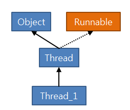

# What I studied today.
Date : 2019-11-26

# JAVA
## 컬렉션
1. 컬렉션(Colllection)
    - 정의 
        - 객체를 수집해서 담을 수 있는 자료구조(컨테이너)
    - 계층구조
        - Iterator &lt; Collection &lt; List
        - Iterator &lt; Collection &lt; Set
        - Map
    - List계열
        - 특징 :
            - 순서가 잇고 중복 저장 가능
        - 구현클래스
            - ArrayList
                - 단일 스레드
            - Vector
                - 멀티 스레드
            - LinkedList
                - 삽입 삭제가 빈번히 이뤄지는 자료구조가 필요시 사용
    - Set 계열
        - 특징
            - 순서가 없고 중복저장 불가능
        - 구현클래스
            - HashSet
            - TreeSet
                - 검색속도가 빠르다     
    - Map 계열
        - 특징
            - 순서가 없고, 키와 값의 쌍으로 저장 키는 중복저장 불가, 값은 중복저장 가능
        - 구현 클래스 
            - HashMap
                - 단일 스레드
            - HashTable
                - 멀티스레드
            - TreeMap
                - 검색용
            - Properties
                - 환경설정용
2. 객체 해시코드 
    - 정의
        - 객체를 식별하는 주소값으로 객체의 메모리 번지를 이용해 해시코드를 만들어 리턴한다.  
        따라서 개별 객체는 해시코드가 모드 다르다.
3. 논리적 동등이란?
    - 객체의 주소값은 다르더라도 실제 내용이 같은 객체
    - 논리적 동등비교 내부 동작 원리
        1. `hashCode()` 리턴값 비교 하여 동일하면 true
            - `Objects.hash()` 사용하여 재정의 권장.
            - 위 메소드는 동일한 매개변수값으로 호출하면 동일한 hashcode를 리턴함
        2. 객체의 `equals()` 리턴값 확인
            - 객체의 멤버필드가 동일한지를 비교하도록 재정의
        - 1,2가 모두 참일 때 동등객체로 판단
        - 원래 순수 hashcode값을 알고싶으면 `System.identityHashCode()` 사용
### 객체 해시코드(hashCode())
- 객체 해시코드란?
    - 객체 식별할 하나의 정수값
    - 객체의 메모리 번지 이용해 해시코드를 만들어 리턴
        - 개별 객체는 해시코드가 모두 다름
- 논리적 동등 비교 시 hashCode()오버라이딩의 필요성
    - 컬랙션 프레임워크의 HashSet, HashMap과 같은 클래스는 두 객체가  
    동등한 객체인지 판단할 때 아래와 같은 과정을 거침
    - 
- 따라서 논리적 동등객체는 hashcode()가 리턴하는 값도 같아야함
- `System.identityHashCode(obj)`: 순수 hashCode()값을 리턴함
- `Objects.hash()`를 권장함
    - 1.7부터 추가
- 논리적 동등비교 예시
    - ```java

        import java.util.HashSet;
        import java.util.Set;

        public class ObjectMain {

            public static void main(String[] args) {
                String name = "홍길동";
                String name2 = "홍길동";
                String name3 = new String("홍길동");
                String name4 = new String("홍길동");
                
                System.out.println(name.hashCode());
                System.out.println(name2.hashCode());
                System.out.println(name3.hashCode());
                System.out.println(name4.hashCode());

                System.out.println("==============");
                Person p1 = new Person("홍길동",30);
                Person p2 = new Person("홍길동",30);
        //		System.out.println(p1.hashCode());
        //		System.out.println(p2.hashCode());
                
                Set<Person> set = new HashSet<>();
                set.add(p1); set.add(p2);
                System.out.println(set.size());
                System.out.println("==============");
                // 순수한 hashcode값 리턴
                System.out.println(System.identityHashCode(p1));
                System.out.println(System.identityHashCode(p2));
            }

        }


        public class Person {
            /* 멤버 필드 */
            private String name;
            private int age;
            
            public Person(String name, int age) {
                this.name = name;
                this.age = age;
                
            }
            @Override
            public boolean equals(Object obj) {
                System.out.println("Person.equals()호출 됨");
                boolean result = false;
                if(obj instanceof Person) {
                    Person p = (Person)obj;
                    if(this.name.equals(p.name) && this.age == p.age) {
                        result = true;
                    }
                }
                return result;
            }
            
            @Override
            public int hashCode() {
                System.out.println("Person.hashCode()호출 됨");
                //		return this.name.hashCode() + age;
		        return Objects.hash(name,age);
            }
        }

        ```
- 출력 결과
    - ```
        54150062
        54150062
        54150062
        54150062
        ==============
        Person.hashCode()호출 됨
        Person.hashCode()호출 됨
        Person.equals()호출 됨
        1
        ==============
        366712642
        1829164700
        ```
## 기타 Object 객체의 멤소드
- finalize()
    - 소멸자
    - GC가 객체를 지울때 호출 됨
- clone()
    - 객체를 복사할 때 호출
## 스레드
- 프로세스(process)
    - 실행 중인 하나의 프로그램
    - 하나의 프로그램이 다중 프로세스를 만들기도 함
- 멀티 태스킹(multi tasking)
    - 두 가지 이상의 작업을 동시에 처리하는 것
    - 멀티 프로세스 
        - 독립적으로 프로그램들을 실행하고 여러 가지 작업 처리 ex)브라우저
    - 멀티 스레드 
        - 한개의 프로그램을 실행하고 내부적으로 여러가지작업 처리 ex)채팅
- 스레드가 실행되는 패턴
    - 하나의 코어에서 여러 스레드가 시분할하여 처리되는 것
        - 동시성
    - 하나의 코어에 하나의 스레드가 처리되는 것
        - 병렬성
- 작업관리자 성능탭
    -  CPU사용현황에서 각 화면이 코어를 나타냄
    - 스레드 개수를 알려줌
- 다중스레드에서 스레드가 어느 하나라도 살아있으면 그 프로세스는 종료된 것이 아님
### Thread Class
- `Runnable` interface를 구현하고 있음
    - `run()`메소드를 프로그래머가 정의해야함
- `Thread.currentThread().getName()`
    - 현재스레드의 이름 출력
- 함수적 인터페이스
    - 인터페이스에 메소드 하나만 정의된 것
- `start()`메소드
    - 프로그래머가 구현한 스레드를 실행하는 메서드
    - [상세](https://docs.oracle.com/javase/8/docs/api/java/lang/Thread.html#start--)
### Thread 예시
- ```java
    public class ThreadMain {

        public static void main(String[] args) {
            // 1) Runnable 인터페이스를 구현
            // 1-1) 이름있는 클래스
            Thread thread = new Thread(new Task1());
            thread.start();
            // 1-2) 익명 클래스
            Thread thread2 = new Thread(new Runnable() {			
                @Override
                public void run() {
                    for(int i='A'; i<'A'+26; i++) {
                        System.out.println(Thread.currentThread().getName() + " : "+(char)i);
                        try {
                            Thread.sleep(500);
                        } catch (InterruptedException e) {
                            // TODO Auto-generated catch block
                            e.printStackTrace();
                        }
                    }
                    System.out.println(Thread.currentThread().getName()+" 종료");
                    
                }
            });
            thread2.start();
            
            // 1-3) 람다식 : 하나의 추상메소드를 갖고있는 인터페이스는 람다식으로 표현가능하다. 
            Thread thread22 = new Thread( ( ) -> {
                for(int i=200;i<210;i++) {
                    System.out.println(Thread.currentThread().getName() + " : "+i);
                    try {
                        Thread.sleep(100);
                    } catch (InterruptedException e) {
                        e.printStackTrace();
                    }
                }
                System.out.println(Thread.currentThread().getName()+" 종료");			
            });
            thread22.start();
            
            // 2) Thread 상속받아서 구현
            // 2-1) 이름 있는 클래스
            Thread_1 thread3 = new Thread_1();
            thread3.start();
            
            // 2-2) 익명 클래스
            Thread thread4 = new Thread() {
                @Override
                public void run() {
                    for(int i=200;i<210;i++) {
                        System.out.println(Thread.currentThread().getName() + " : "+i);
                        try {
                            Thread.sleep(100);
                        } catch (InterruptedException e) {
                            e.printStackTrace();
                        }
                    }
                    System.out.println(Thread.currentThread().getName()+" 종료");
                }
            };
            thread4.start();
        
            
            for(int i=0;i<5;i++) {
                System.out.println(Thread.currentThread().getName() + " : "+i);
                try {
                    Thread.sleep(500); // 0.5초 지연
                } catch (InterruptedException e) {
                // e.printStackTrace();
                    System.out.println("오류발생!");
                }
            }
            
            
            
            // 현재 스레드(task,작업)의 이름 출력
            System.out.println(Thread.currentThread().getName()+" 종료");
            
        }

    }
    // 1) Runnable 인터페이스를 구현
    // 1-1) 이름있는 클래스
    public class Task1 implements Runnable {

        @Override
        public void run() {
            for(int i=5;i<10;i++) {
                System.out.println(Thread.currentThread().getName() + " : "+i);
                try {
                    Thread.sleep(100);
                } catch (InterruptedException e) {
                    e.printStackTrace();
                }
            }
            System.out.println(Thread.currentThread().getName()+" 종료");
        }
    }


    //2) Thread 상속받아서 구현
    public class Thread_1 extends Thread {
        @Override
        public void run() {		
            for(int i=100;i<110;i++) {
                System.out.println(Thread.currentThread().getName() + " : "+i);
                try {
                    Thread.sleep(100);
                } catch (InterruptedException e) {
                    e.printStackTrace();
                }
            }
            System.out.println(Thread.currentThread().getName()+" 종료");
        }
    }

    ```
    - 
### 스레드 스케줄링
- 스레드의 개수가 코어의 수보다 많을 경우
    - 스레드를 어떤 순서로 동시성으로 실행할 것인가
        - 스레드 스케줄링
    - 스케줄링에 의해 스레드들은 번갈아가며 `run()`메소드를 조금씩 실행
- 자바의 스레드 스케줄링
    - 우선순위(Priority) 방식과 순환 할당(Round-Robin) 방식 사용
        - 우선순위 방식(코드로 제어가능)
            - 우선순위가 높은 스레드가 실행 상태를 더 많이 가지도록 스케줄링하는 방식
            - 1~10까지 값을 가질 수 있으며 기본은 5
        - 순활 할당 방식(코드로 제어할 수 없음)
            - 시간 할당량(Time Slice) 정해서 하나의 스레드를 정해진 시간만큼 실행하는 방식
- 스레드 우선순위
    - 스레드들이 동시성을 가질 경우 우선적으로 실행 할 수 있는 순위
- 공유 객체를 사용할 때의 주의할 점
    - 멀티 스레드가 하나의 객체를 공유해서 생기는 오류

## 스레드 용어정리
1. 멀티태스킹(multi tasking)
    - 두가지 이상의 작업을 동시에 처리하는 행위
    - 구현방법
        1. 멀티 프로세스 :
            - 독립적인 프로그램을 여러번 실행하고 작업을 처리
        2. 멀티 스레드
            - 하나의 프로그램을 실행하여 내부적으로 여러작업을 처리
2. 프로세스의 종료
    - 프로세스는 적어도 하나의 스레드를 가진다.
    - 싱글 스레드 :
        - 메인스레드가 종료하면 프로세스가 종료됨
    - 멀티 스레드 
        - 실행중인 스레드가 하나라도 존재하면 프로세스는 종료되지 않는다.
        - 모든스레드가 종료될 때 프로세스는 종료한다.
3. 스레드 생성 방법
    1. Thread 클래스로부터 직접 Runnable를 구현하여 생성
    2. Thread를 상속받아 생성
4. 동시성과 병렬성
    - 동시성
        - 하나의 코어에 멀티 스레드가 번갈아 가며 실행하는 성질
    - 병렬성
        - 멀티 코어에서 개별 스레드가 동시에 실행하는 성질
    - 실제 스레드 환경에서는 동시성과 병렬성이 공존한다.
5. 스레드 실행시 run() 메소드를 호출하지 않고 start()메소드를 호출하는 이유
    - 스레드는 자바의 스레드 스케줄링에 의해서 우선순위 방식 또는
    순환할당 방식으로 실행되기 때문.
6. 동기화 메소드와 동기화 블록
    - 목적
        - 멀티 스레드가 하나의 객체를 공유해서 생기는 오류 방지하기 위함
    - ex)
        - 동기화 메소드
            ```java
                public synchronized void setMemory(int memory) { /* 실행 구문 */ }
                ```
        - 동기화 블록
            ```java
                synchronized(this) { /* 실행 구문 */ }
                ```
# Database
## 데이터 베이스 용어
* 인덱스(index) :
    * 정의 : 
        * 테이블에 저장된 데이터를 빠르게 조회하기 위한 데이터베이스 객체
    * 장점 : 
        * 검색속도가 빨라진다
        * 시스템 부하를 줄여 전체 시스템의 성능을 향상시킨다.(ex, 조인)
    * 단점 : 
        * 인덱스 생성시 추가적인 database 공간을 차지한다 ( table의 10%내외)
        * 업데이트를 (insert, update, delete)가 자주 발생되는 컬럼에 사용시
        오히려 속도 저해 요인이 된다.
    * 주의할점 : 
        * Where 절에 자주 사용되는 속성
        * 조인에 자주 사용되는 속성
        * 선택도가 낮을 수록 유리함.(ex 모든 속성값이 다른 경우, primary key)
            * 선택도 = 1/"서로 다른 값의 갯수"
        * 단편화(삭제된 레코드의 인덱스 값 자리가 비게되는 상태)현상 최소화를 위해 
        주기적으로 인덱스를 갱신(rebuild)해준다.
* 트랜잭션
    * 정의
        * DBMS에서 데이터를 다루는 논리적인 작업단위
    * 목적 
        1. 여러작업이 동시에 같은 데이터를 다룰 때 작업분리 단위.
        2. 장애발생시 데이터 복구 작업단위.
    * 명령어 
        * commit
            * 트랜잭션 과정을 정상적으로 종료하는 명령어
        * rollback
            * 트랜잭션 전체 또는 (저장점, 중간점)까지 취소하는 명령어.
        * savepoint
            * 하나의 트랜잭션을 분할 저장하여 현시점에서 저장점까지 트랜잭션 일부만 취소(rollback)가능하도록 지원하는 명령어.
## 트랜잭션의 네 가지 성질
1. 원자성(Atomicity)
    * 트랜잭션에 포함된 작업은 전부 수행되거나 아니면 전부 수행되지 않아야(all or nothing)한다.
2. 일관성(Consistency)
    * 트랜잭션을 수행하기 전이나 수행한 후나 데이터베이스는 항상 일관된 상태를 유지해야 한다.
3. 고립성(Isolation)
    * 수행 중인 트랜잭션에 다른 트랜잭션이 끼어들어 변경 중인 데이터 값을 훼손하는 일이 없어야 한다.
4. 지속성(Durability) 
    * 수행을 성공적으로 완료한 트랜잭션은 변경한 데이터를 영구히 저장해야한다.
    * 저장된 데이텁메이스는 저장 직후 혹은 어느 때나 발생할 수 있는 정전, 장애, 오류에 영향을 받지 않아야 한다.
## 데이터사전
- 테이블 구조 조회
    - ```SQL
        SELECT * FROM ALL_TAB_COLUMNS WHERE TABLE_NAME='BOOK';
        ```
- 제약조건 조회
     - ```SQL
        SELECT * FROM ALL_CONSTRAINTS WHERE TABLE_NAME = 'WORKS';
         ```
# 기타

[돌아가기](../README.md)  
[2019-11-22](whatIStudied_191122.md)  
[2019-11-26](whatIStudied_191126.md) 