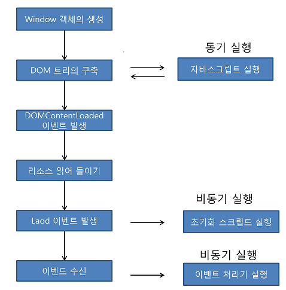

# What I studied today.
Date : 2019-12-12

# 웹표준
## 웹페이지를 읽어들이는 순서 & 자바스크립트 코드의 실행 흐름
- 웹브라우저로 웹페이지를 열면 가장 먼저 window 객체가 생성됨 (전역객체로 웹페이지와 탭마다 생성)
- Document객체가 window객체의속성으로 생성됨
    DOM트리 구축시도(document.readyState="loading")
- HTML 문서는 구문분석에 따라 document객체요소와 텍스트 노드를 추가
- script 요소에 저장된 구문분석후 동기적으로 실행함 HTML문서의 구문분석이 일시정지되며 자바스크립트 실행 완료후 HTML 문서 구문분석 재개함.
- document 객체에 DOM트리 구축완료되면 (document.readyState="interactive")로 바뀜 document객체에 DOMContentLoaded 이벤트발생
- 모든 외부리소스(이미지등)을 읽어들인 후(document.readyState="complete")로 바뀜
- window객체에 load이벤트 발생
- 이후 다양한 이벤트 처리가 비동기적으로 실행됨
- 
## VSCode tip
- [Emmet 기능 tip](https://docs.emmet.io/cheat-sheet/)

# 과제
## 화면구현 과제
- 16일 중간 발표
### 요구사항
- 로그인/로그아웃은 serverside javascript로 간이적으로 구현할 것
- 계획서에서 실제결과/테스트 결과 
### 화면계획서
- 사이트맵

# Database
## 용어정리 2
- sequence 시퀀스
    - 용도: 순차적으로 중복되지 않는 번호를 자동으로  
            발생시킬 필요가 있는 컬럼에 사용한다(기본키, 대리키 등)
    - 특징 : 테이블과 별도의 공간에 저장  
            DML이 롤백되어도 이미 생성된 시퀀스 번호는 롤백되지 않다.
- synonym 시노님(동의어)
    - 목적
        - 편의성
            - 간단한 별칭사용
            - 사용자 계정 없이도 접근가능  
                (public synonym: admin만 생성가능)
        - 보안성
            - 원객체를 숨길 수 있어 보안에 유리, 특히 public은 소유자도 숨김
- 무결성 p(88~89)
    - 개체무결성 
        - 릴레이션 내에 기본키(null값 없음, 중복없음)를 가져야 함
    - 참조무결성
        - 왜래키는 부모 릴레이션의 기본키를 참조하고 도메인이 동일해야함
    - 도메인무결성
        - 릴레이션 내의 튜플들이 각속석의 도메인에 지정된 값만을 가져야 함
- 인덱스 유효성 여부 검사
    1. 인덱스 분석자료 수짐
        - ```sql
            analyze index 인덱스이름 validate structure;
            ```
    2. 인덱스 분석된 통계자료조회
        - ```sql
            select * from index_stats;
            ```
    3. 인덱스 삭제비율(del_if_rows / if_rows)이 높으면 Rebuild
        - `lf_rows`
            - 인덱스 생성 시 만들어진 레코드 수
        - `del_lf_rows`
            - 인덱스 생성 후 삭제된 레코드 수
        - ```sql
- 아래 절차에 따라 역할 생성 및 권한을 부여하는 SQL문을 작성하시오.
    1. 'programmer'라는 역할 생성
        - ```sql
            CREATE ROLE programmer;
            ```
    2. 'programmer' 역할에 CREATE ANY TABLE과 CREATE ANY VIEW 권한을 부여
        - ```SQL
            GRANT CREATE ANY TABLE, CREATE ANY VIEW TO PROGRAMMER;
            ```
    3. user1에 programmer 역할의 권한을 부여
        - ```SQL
            GRANT programmer TO user1;
            ```
- 아래 내용을 참고하여 계정 생성 및 권한을 부여하는 명령문을 각각 작성하시오
    - |속성|값|
        |---|---|
        |사용자계정|USER1|
        |비밀번호|1234|
        |테이블스페이스|MD_TBS|
        |권한 |접속(CONNECT), 테이블생성(RESOURCE)
    - 계정 생성 
        - ```SQL
            CREATE USER user1 identified by 1234 default tablespace md_tbs;
    - 권한부여
        - ```SQL
            GRANT CONNECT, RESOURCE TO user1;
            ```
- '10M' 용량의 테이블 스페이스 'MD_TBS'를 'D:\madang\oradata' 폴더에 생성하시오. 이때 데이터 파일 이름은 md_tbs_data.dbf, 블록사이즈는 4KByte인 SQL문을 작성하시오. 또한 데이터파일의 이용현황을 조회하는 SQL문을 작성하시오
    - ```sql
        CREATE TABLESPACE MD_TBS DATAFILE 'D:\madang\oradata\md_tbs_data.dbf' size 10m BLOCKSIZE 4k;
        ```
    - ```sql 
        select * from dba_data_files;
        ```
- 데이터베이스 블록사이즈는 데이터 I/O의 기본단위이다. 블록 사이즈를 크게 했을때와 작게 했을때의 시스템 성능에 미치는 장단점 1가지씩을 각각 작성하시오.
    - 블록사이즈가 클 때
        - 장점 : 
            - 한번에 저장할 데이터량이 많아서 I/O 트래픽 감소
        - 단점 : 
            - 데이터가 적을경우 공간낭비 발생
        - 활용 :
            - 세선이 적고 대량의 데이터접근(ex DW, DataWarehouse)
    - 블록사이즈가 작을 때
        - 장점 :
            - 데이터가 적을경우 공간 효율이 좋음
        - 단점 : 
            - 한번에 저장할 데이터량이 적어서 I/O 트래픽 증가
        - 활용 : 
            - 빈번한 세션단위의 소량 데이터 접근 (ex OLTP, Online Transaction Processing)
- 오라클 데이터베이스 주요 파일 3가지를 나열하시오 - p239
    1. 데이터파일(Data File)
    2. 리두로그(Redo Log)
    3. 컨트롤 파일(Control File)
- 오라클 접속 정보 설정 파일중 listener.ora, tnsnames.ora 의 용도를 각각 작성하시오.
    - tnsnames.ora :
        - 오라클 클라이언트에서 서버로 접속할때 필요한 프로토콜, 포트번호, 서버주소, 인스턴스 등을 설정하는 파일로 클라이언트에 존재함
    - listener.ora :
        - 클라이언트에서 오라클 서버로 접속할때 필요한 프로토콜, 포트번호 등을 설정해주는 파일로 서버에 존재함.
    - `%ORACLE_HOME%/network/admin/listener.ora`
    - `%ORACLE_HOMT%/network/admin/tnsname.ora`

## tablespace block size 지정시 오류
> ORA-29339: tablespace block size 4096 does not match configured block sizes
> 29339. 00000 -  "tablespace block size %s does not match configured block sizes"
> *Cause:    The block size of the tablespace to be plugged in or
>            created does not match the block sizes configured in the
>            database.
> *Action:   Configure the appropriate cache for the block size of this
>            tablespace using one of the various (db_2k_cache_size,
>            db_4k_cache_size, db_8k_cache_size, db_16k_cache_size,
>            db_32K_cache_size) parameters.

<br>
<br>

[돌아가기](../README.md)  
[2019-12-11](whatIStudied_191211.md)  
[2019-12-13](whatIStudied_191213.md) 

