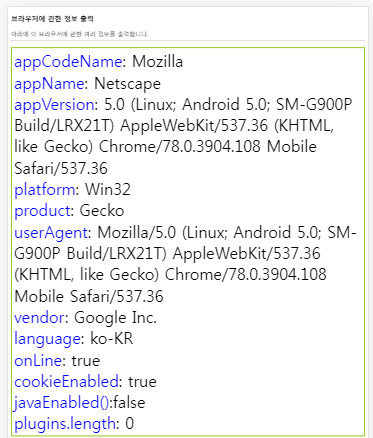

# What I studied today.
Date : 2019-12-13

# 웹표준
## BOM
### window 객체
- 열려있는 브라우저 윈도우나 탭 윈도우를 나타내는 객체
### navigator 객체
- 현재 작동중인 브라우저에 대한 다양한 정보를 가짐
- 크롬개발도구의 디바이스 툴바
    - device를 모바일기기로 바꾸면 navigator 객체의 값도 바뀜
        - 
    - 모바일 device인 상태로 네이버에 접속(pc버전 url)하면 모바일버전으로 url이 바뀜
## 연습문제 chapter 10
### 이론 문제
#### 1번
- 답 : 2번
#### 2번
- 답 : 2번
#### 3번
##### (1) 
```javascript
window.open("test.html","win");
```
##### (2) 
```javascript
window.open("http://www.google.co.kr","_self");
```
##### (3) 
```javascript
window.open("","_blank","left=100,top=100,width=500,height=600");
```
##### (4) 
```javascript
window.open()
```

#### 4번
##### (1)
```javascript
window.open("","_blank","left=100,top=100,width=500,height=600");
```
##### (2)
```
window.open("http://www.google.com","google");
```
#### 5번
- 답 : 3번

#### 6번
- 답 : 1번
#### 7번
- 답 : 4번
- ```javascript
    history.go(0); // 새로고침하는 코드
    ```
#### 8번
- 답 : 3번
#### 9번
- 답 : 3
- `setInterval()`도 delay이후 실행된다.
    - 바로실행된다는 것은 오해
#### 10번
- 답 : 
```javascript
var sum=0;
function f() {    
    sum++;
    id = setTimeout("f()",2);
    if(sum==10) clearTimeout(id);
}
var id = setTimeout("f()",2);
```
## 실습문제
# Database
## 환경설정
https://cafe.naver.com/ulsankhjava/78

<br><br>


[돌아가기](../README.md)  
[2019-12-12](whatIStudied_191212.md)  
[2019-12-16](whatIStudied_191216.md) 

