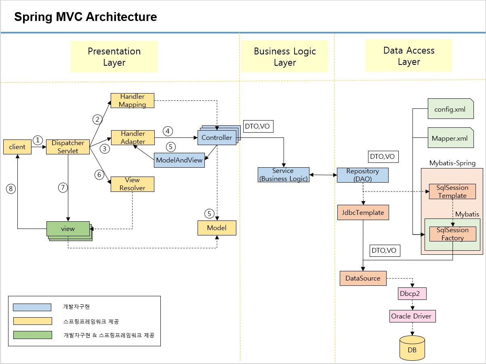

# What I studied today.
Date : 2020-01-28
# 팀 프로젝트 
## 팀프로젝트 주제 발표
- 다음을 작성할 것
    - 1 프로젝트 개요
        - 1.1 추진배경
        - 1.2 목적 / 목표
    - 위 내용을 2~3페이지 정도 
# JSP2.3 & Servlet 3.1
# Spring
## 스프링 특징
- POJO(Plain Old Java Object) 기반의 프레임워크
    - 자바 객체의 라이프사이클을 스플이 컨테이너가 직접 관리하며, 스프링 컨테이너로부터 필요한 객체를 얻어올 수 있습니다.
- DI(Dependency Injection)을 지원
    - 각 계층이나 서비스들 사이 또는 객체들 사이에 의존성이 존재할 경우 스프링 프레임워크가 서로를 연결시켜줍니다. 이는 클래스들 사이에 약한 결합을 가능케 합니다.
- AOP(Aspect Oriented Programming)를 지원
    - 트랜잭션, 로깅, 보안 등 여러 모듈에서 공통적으로 지원하는 기능을 분리하여 사용할 수 있습니다.
- 확장성이 높다.
    - 스프링 프레임워크의 소스는 모드 라이브러리로 분리시켜 놓음으로써 필요한 라이브러리만 가져다 쓸 수 있습니다. 그리고 많은 외부 라이브러리들도 이미 스프링 프레임워크와 연동되고 있습니다.
- Model2 방식의 MVC Framework를 지원
## Spring MVC Architecture
<!--  -->


## 스프링 프로젝트 생성하기
- new -> spring legacy project
- pom.xml
    - ```xml
        <?xml version="1.0" encoding="UTF-8"?>
        <project xmlns="http://maven.apache.org/POM/4.0.0"
            xmlns:xsi="http://www.w3.org/2001/XMLSchema-instance"
            xsi:schemaLocation="http://maven.apache.org/POM/4.0.0 https://maven.apache.org/maven-v4_0_0.xsd">
            <modelVersion>4.0.0</modelVersion>
            <groupId>com.kh</groupId>
            <artifactId>portfolio</artifactId>
            <name>portfolio</name>
            <packaging>war</packaging>
            <version>1.0.0-BUILD-SNAPSHOT</version>
            <properties>
                <java-version>1.8</java-version>
                <org.springframework-version>5.2.3.RELEASE</org.springframework-version>
                <org.aspectj-version>1.9.5</org.aspectj-version>
                <org.slf4j-version>1.7.30</org.slf4j-version>
            </properties>
            <repositories>
                <repository>
                    <id>oracle</id>
                    <name>ORACLE JDBC Repository</name>
                    <url>https://maven.xwiki.org/externals</url>
                </repository>
            </repositories>
            <dependencies>
                <!-- Spring -->
                <dependency>
                    <groupId>org.springframework</groupId>
                    <artifactId>spring-context</artifactId>
                    <version>${org.springframework-version}</version>
                    <exclusions>
                        <!-- Exclude Commons Logging in favor of SLF4j -->
                        <exclusion>
                            <groupId>commons-logging</groupId>
                            <artifactId>commons-logging</artifactId>
                        </exclusion>
                    </exclusions>
                </dependency>
                <dependency>
                    <groupId>org.springframework</groupId>
                    <artifactId>spring-webmvc</artifactId>
                    <version>${org.springframework-version}</version>
                </dependency>

                <!-- AspectJ -->
                <dependency>
                    <groupId>org.aspectj</groupId>
                    <artifactId>aspectjrt</artifactId>
                    <version>${org.aspectj-version}</version>
                </dependency>

                <!-- Logging -->
                <dependency>
                    <groupId>org.slf4j</groupId>
                    <artifactId>slf4j-api</artifactId>
                    <version>${org.slf4j-version}</version>
                </dependency>
                <dependency>
                    <groupId>org.slf4j</groupId>
                    <artifactId>jcl-over-slf4j</artifactId>
                    <version>${org.slf4j-version}</version>
                    <scope>runtime</scope>
                </dependency>
                <dependency>
                    <groupId>org.slf4j</groupId>
                    <artifactId>slf4j-log4j12</artifactId>
                    <version>${org.slf4j-version}</version>
                    <scope>runtime</scope>
                </dependency>
                <dependency>
                    <groupId>log4j</groupId>
                    <artifactId>log4j</artifactId>
                    <version>1.2.15</version>
                    <exclusions>
                        <exclusion>
                            <groupId>javax.mail</groupId>
                            <artifactId>mail</artifactId>
                        </exclusion>
                        <exclusion>
                            <groupId>javax.jms</groupId>
                            <artifactId>jms</artifactId>
                        </exclusion>
                        <exclusion>
                            <groupId>com.sun.jdmk</groupId>
                            <artifactId>jmxtools</artifactId>
                        </exclusion>
                        <exclusion>
                            <groupId>com.sun.jmx</groupId>
                            <artifactId>jmxri</artifactId>
                        </exclusion>
                    </exclusions>
                    <scope>runtime</scope>
                </dependency>

                <!-- @Inject -->
                <dependency>
                    <groupId>javax.inject</groupId>
                    <artifactId>javax.inject</artifactId>
                    <version>1</version>
                </dependency>

                <!-- Servlet -->
                <!-- <dependency> <groupId>javax.servlet</groupId> <artifactId>servlet-api</artifactId> 
                    <version>2.5</version> <scope>provided</scope> </dependency> <dependency> 
                    <groupId>javax.servlet.jsp</groupId> <artifactId>jsp-api</artifactId> <version>2.1</version> 
                    <scope>provided</scope> </dependency> <dependency> <groupId>javax.servlet</groupId> 
                    <artifactId>jstl</artifactId> <version>1.2</version> </dependency> -->
                <dependency>
                    <groupId>javax.servlet</groupId>
                    <artifactId>javax.servlet-api</artifactId>
                    <version>4.0.1</version>
                    <scope>provided</scope>
                </dependency>
                <!-- Servlet 끝 -->

                <!-- jstl 시작 -->
                <dependency>
                    <groupId>org.apache.taglibs</groupId>
                    <artifactId>taglibs-standard-spec</artifactId>
                    <version>1.2.5</version>
                </dependency>
                <dependency>
                    <groupId>org.apache.taglibs</groupId>
                    <artifactId>taglibs-standard-impl</artifactId>
                    <version>1.2.5</version>
                </dependency>
                <dependency>
                    <groupId>org.apache.taglibs</groupId>
                    <artifactId>taglibs-standard-jstlel</artifactId>
                    <version>1.2.5</version>
                </dependency>
                <!-- jstl 끝 -->

                <!-- Spring-jdbc 시작 -->
                <dependency>
                    <groupId>org.springframework</groupId>
                    <artifactId>spring-jdbc</artifactId>
                    <version>${org.springframework-version}</version>
                </dependency>
                <!-- Spring-jdbc 끝 -->

                <!-- oracle 드라이버 시작 -->
                <dependency>
                    <groupId>com.oracle.jdbc</groupId>
                    <artifactId>ojdbc8</artifactId>
                    <version>12.2.0.1</version>
                </dependency>
                <!-- oracle 드라이버 끝 -->

                <!-- 커넥션 풀 시작 -->
                <dependency>
                    <groupId>org.apache.commons</groupId>
                    <artifactId>commons-dbcp2</artifactId>
                    <version>2.7.0</version>
                </dependency>
                <!-- 커넥션 풀 끝 -->

                <!-- MyBatis 시작 -->
                <dependency>
                    <groupId>org.mybatis</groupId>
                    <artifactId>mybatis</artifactId>
                    <version>3.5.3</version>
                </dependency>
                <dependency>
                    <groupId>org.mybatis</groupId>
                    <artifactId>mybatis-spring</artifactId>
                    <version>2.0.3</version>
                </dependency>
                <!-- MyBatis 끝 -->

                <!-- Test -->
                <!-- <dependency> <groupId>junit</groupId> <artifactId>junit</artifactId> 
                    <version>4.7</version> <scope>test</scope> </dependency> -->
                <!-- JUnit 시작 -->
                <dependency>
                    <groupId>org.junit.jupiter</groupId>
                    <artifactId>junit-jupiter-api</artifactId>
                    <version>5.6.0</version>
                    <!-- <scope>test</scope> -->
                </dependency>
                <dependency>
                    <groupId>org.junit.jupiter</groupId>
                    <artifactId>junit-jupiter-engine</artifactId>
                    <version>5.6.0</version>
                    <!-- <scope>test</scope> -->
                </dependency>
                <!-- JUnit 끝 -->
                <!-- Spring-test 시작 -->
                <dependency>
                    <groupId>org.springframework</groupId>
                    <artifactId>spring-test</artifactId>
                    <version>${org.springframework-version}</version>
                    <scope>test</scope>
                </dependency>
                <!-- Spring-test 끝 -->

                <!-- jdbc로그 라이브러리 시작 -->
                <dependency>
                    <groupId>org.bgee.log4jdbc-log4j2</groupId>
                    <artifactId>log4jdbc-log4j2-jdbc4.1</artifactId>
                    <version>1.16</version>
                </dependency>
                <!-- jdbc로그 라이브러리 끝 -->

                <!-- 데이터 포맷 변환 시작 -->
                <!-- json 포맷을 java객체로 변환 or java객체를 json포맷으로 변환 -->
                <dependency>
                    <groupId>com.fasterxml.jackson.core</groupId>
                    <artifactId>jackson-databind</artifactId>
                    <version>2.10.2</version>
                </dependency>
                <!-- xml포맷을 java객체로 변환 or java객체를 xml포맷으로 변환 -->
                <dependency>
                    <groupId>com.fasterxml.jackson.dataformat</groupId>
                    <artifactId>jackson-dataformat-xml</artifactId>
                    <version>2.10.2</version>
                </dependency>
                <!-- 데이터 포맷 변환 끝 -->

                <!-- 파일 업로드 시작 -->
                <dependency>
                    <groupId>commons-fileupload</groupId>
                    <artifactId>commons-fileupload</artifactId>
                    <version>1.4</version>
                </dependency>
                <!-- 파일 업로드 끝 -->

            </dependencies>
            <build>
                <plugins>
                    <plugin>
                        <artifactId>maven-eclipse-plugin</artifactId>
                        <version>2.10</version>
                        <configuration>
                            <additionalProjectnatures>
                                <projectnature>org.springframework.ide.eclipse.core.springnature</projectnature>
                            </additionalProjectnatures>
                            <additionalBuildcommands>
                                <buildcommand>org.springframework.ide.eclipse.core.springbuilder</buildcommand>
                            </additionalBuildcommands>
                            <downloadSources>true</downloadSources>
                            <downloadJavadocs>true</downloadJavadocs>
                        </configuration>
                    </plugin>
                    <plugin>
                        <groupId>org.apache.maven.plugins</groupId>
                        <artifactId>maven-compiler-plugin</artifactId>
                        <version>3.8.1</version>
                        <configuration>
                            <source>1.8</source>
                            <target>1.8</target>
                            <compilerArgument>-Xlint:all</compilerArgument>
                            <showWarnings>true</showWarnings>
                            <showDeprecation>true</showDeprecation>
                        </configuration>
                    </plugin>
                    <plugin>
                        <groupId>org.codehaus.mojo</groupId>
                        <artifactId>exec-maven-plugin</artifactId>
                        <version>1.2.1</version>
                        <configuration>
                            <mainClass>org.test.int1.Main</mainClass>
                        </configuration>
                    </plugin>
                </plugins>
            </build>
        </project>
        ```


### 스프링 프로젝트의 설정파일
- servlet-context.xml
    - 서블릿 컨텍스트 설정
    - 서버가 구동할 때 @Controller 어노테이션이 붙은 것들을 자동으로 찾아옴
- root-context.xml
    - 서블릿 이외의 것들의 컨텍스트 설정
- web.xml
- pom.xml
- database.properties
#### servlet-context.xml
```xml
<?xml version="1.0" encoding="UTF-8"?>
<beans:beans xmlns="http://www.springframework.org/schema/mvc"
	xmlns:xsi="http://www.w3.org/2001/XMLSchema-instance"
	xmlns:beans="http://www.springframework.org/schema/beans"
	xmlns:context="http://www.springframework.org/schema/context"
	xsi:schemaLocation="http://www.springframework.org/schema/mvc https://www.springframework.org/schema/mvc/spring-mvc.xsd
		http://www.springframework.org/schema/beans https://www.springframework.org/schema/beans/spring-beans.xsd
		http://www.springframework.org/schema/context https://www.springframework.org/schema/context/spring-context.xsd">

	<!-- DispatcherServlet Context: defines this servlet's request-processing infrastructure -->
	
	<!-- Enables the Spring MVC @Controller programming model -->
	<!-- 	@Controller가 붙은 클래스를 서버구동시 스프링컨테이너가 자동으로 빈 등록하도록 설정 -->
	<annotation-driven />
  
	<!-- Handles HTTP GET requests for /resources/** by efficiently serving up static resources in the ${webappRoot}/resources directory -->
	<!-- 	정적페이지 매핑경로설정 -->
	<resources mapping="/resources/**" location="/resources/" />

	<!-- Resolves views selected for rendering by @Controllers to .jsp resources in the /WEB-INF/views directory -->
	<!-- 	뷰를 찾기위한 세팅 정보 -->
	<beans:bean class="org.springframework.web.servlet.view.InternalResourceViewResolver">
		<beans:property name="prefix" value="/WEB-INF/views/" />
		<beans:property name="suffix" value=".jsp" />
	</beans:bean>
	<!-- 	component : @Controller, @Service, @Repository 중에서 
				@Controller가 있는 클래스만 인스턴스화 하도록 설정함 -->
	<context:component-scan base-package="com.kh.portfolio"
													use-default-filters="false"> 
				<context:include-filter type="annotation" expression="org.springframework.stereotype.Controller"/>
	</context:component-scan>
</beans:beans>
```
#### root-context.xml
```xml
<?xml version="1.0" encoding="UTF-8"?>
<beans xmlns="http://www.springframework.org/schema/beans"
	xmlns:xsi="http://www.w3.org/2001/XMLSchema-instance"
	xmlns:context="http://www.springframework.org/schema/context"
	xsi:schemaLocation="http://www.springframework.org/schema/beans https://www.springframework.org/schema/beans/spring-beans.xsd
		http://www.springframework.org/schema/context http://www.springframework.org/schema/context/spring-context-4.3.xsd">
	
	<!-- Root Context: defines shared resources visible to all other web components -->
	
	<context:property-placeholder location="classpath:config/database.properties"/>
	
	<!-- 	db연동 설정 -->
	<bean id="dataSource" class="org.apache.commons.dbcp2.BasicDataSource">
		<property name="driverClassName" value="${db.driverClass}"/>
		<property name="url" value="${db.url}"/>
		<property name="username" value="${db.username}"/>
		<property name="password" value="${db.password}"/>
	</bean>
	<bean id="jdbcTemplate" class="org.springframework.jdbc.core.JdbcTemplate">
		<constructor-arg ref="dataSource"/>
	</bean>
	
	<!-- 	component : @Controller, @Service, @Repository 중에서 
				@Controller를 제외한 클래스만 인스턴스화 하도록 설정함-->
	<context:component-scan base-package="com.kh.portfolio"> 
		<context:exclude-filter type="annotation" expression="org.springframework.stereotype.Controller"/>
	</context:component-scan>
</beans>
```
#### database.properties
```
db.driverClass=net.sf.log4jdbc.sql.jdbcapi.DriverSpy
db.url=jdbc:log4jdbc:oracle:thin@127.0.0.1:xe
db.username=[username]
db.password=[password]
```

<br><br><hr>
[돌아가기](../README.md)  
[2020-01-23](whatIStudied_200123.md)  
[2020-01-29](whatIStudied_200129.md)  


