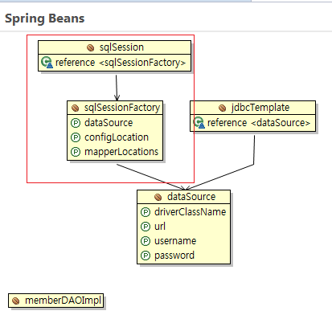

# What I studied today.
Date : 2020-01-31

# Spring
## JdbcTemplate
- method 종류
    - select 문 관련
        1. query()
            - 단일행, 복수행
        2. queryForList()
            - 복수행
        3. queryForObject()
            - 단일행
        4. queryForMap()
            - 단일행
        5. queryForRowSet()
            - 복수행
    - insert,k update, delete 관련
        1. update()

### RowMapper interface
> An interface used by JdbcTemplate for mapping rows of a ResultSet on a per-row basis. Implementations of this interface perform the actual work of mapping each row to a result object, but don't need to worry about exception handling. SQLExceptions will be caught and handled by the calling JdbcTemplate.
- 자주쓰는 RowMapper 구현 클래스
    -  BeanPropertyRowMapper


## 데이터 엑세스 기술
- JDBC
    - 자바에서 관계형 데이터베이스 접속기술
    - JDBC레벨에서 지원하며 다른 고수준 기술의 기반이 됨
- Spring JDBC
    - 스프링 자체적으로 지원하는 JDBC Wrapper
- MyBatis
    - Third-party 자바-관계형 DB매핑 라이브러리
    - 자바 오브젝트와 SQL문을 자동으로 매핑 -SQL Mapper
- JPA
    - Java ORM(Object Relation Mapping)표준 인터페이스
    - 데이터베이스나 쿼리를 인식하지 않고 자바객체를 가지고 CRUD작업한다.
    - SI프로젝트보다는 데이터베이스에 종속적이면 안되고 다양한 환경에 적용가능한 솔루션에 주로 사용함.
    - 자동메핑이 불가한 경우는 native SQL도 지원함
- Hibernate
    - 자바 ORM 구현체
## Mybatis 연동 설정
- [mybatis 시작하기](https://mybatis.org/mybatis-3/ko/getting-started.html)
- 의존성 추가
    - Mybatis
    - Mybatisspring
- sqlSessionFactory, sqlSession 빈 등록
    - Mybatis 사용을 위한 빈 등록
    - root-context 에 다음 코드 추가  
        ```xml
        <!-- mybatis-spring 시작 -->
        <bean id="sqlSessionFactory" class="org.mybatis.spring.SqlSessionFactoryBean">
            <property name="dataSource" ref="dataSource"/>
            <property name="configLocation" value="classpath:/config/mybatis-config.xml"/>
            <property name="mapperLocations" value="classpath:/mappers/**/*mapper.xml"/>
        </bean>
        <bean id="sqlSession" class="org.mybatis.spring.SqlSessionTemplate">
            <constructor-arg ref="sqlSessionFactory"/>
        </bean>
        <!-- mybatis-spring 끝 -->
        ```    
        - 이후 Beans Graph 탭을 열면 다음 그림처럼 확인 됨  
            
        - `**`는 하위폴더 경로까지 찾겠다는 뜻임
- mybatis-config.xml
    - mybatis 메인 설정 파일
    - classpath:src/main/resource 디렉토리 밑에 mybatis-config.xml파일 생성
        - src/main/resource/config 폴더
    - 파일이 없으면 에러가 발생
        - 내용이없어도 파일은 만들어둬야함
- mybatis 플러그인 설치
    - MyBatipse 설치
- mapper.xml 작성
    - mapper문법 정의
        - http://mybatis.org/dtd/mybatis-3-config.dtd

# 팁
- javadoc 다운받기
    - maven library를 우클릭한뒤 maven 클릭 javadoc 다운로드

<br><br><hr>

[돌아가기](../README.md)  
[2020-01-30](whatIStudied_200130.md)  
[2020-02-03](whatIStudied_200203.md)  


